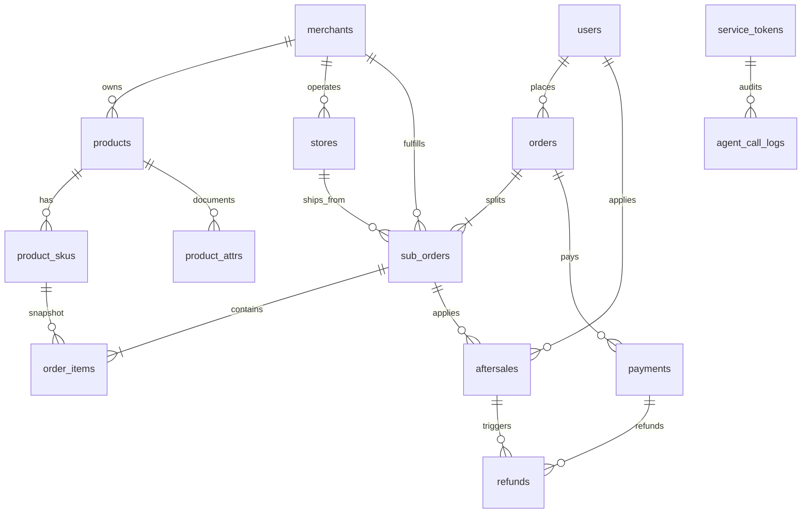
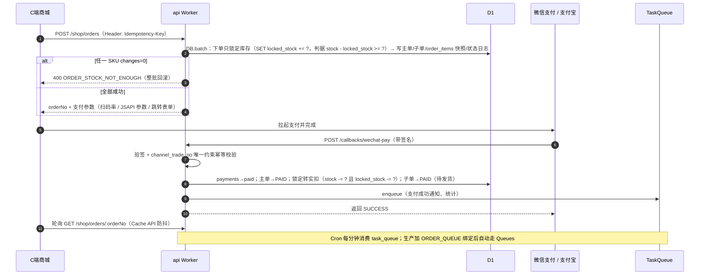
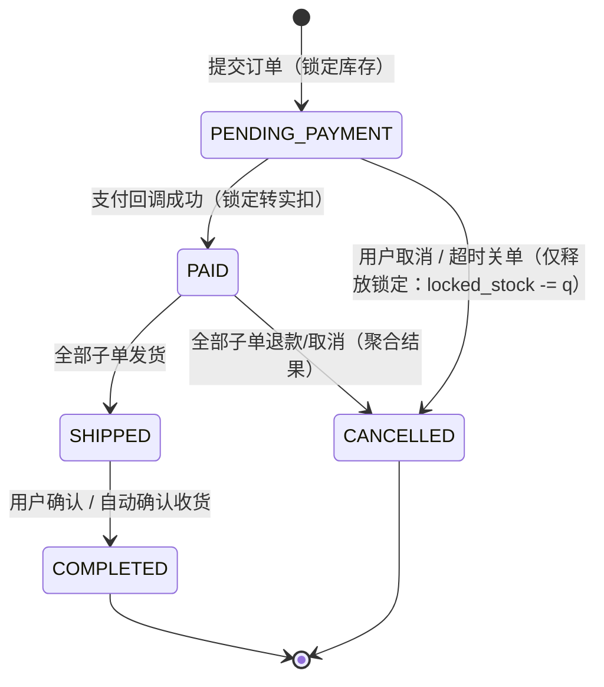

# DShop 商城平台 · 架构设计文档

> **文档状态**：设计稿 v1.0（重写版）｜ **日期**：2026-09-24 ｜ **技术基线**：TypeScript + Cloudflare 全托管（Workers / D1 / KV / R2 / Cron Triggers，Queues 按需）
> **与 PiEcho 的关系**：DShop 是一个功能完整的电商平台（自有 C 端商城、平台后台、商户后台），但在**本项目**中，它的第一职责是**为 PiEcho 智能客服系统提供业务事实数据与受控操作能力**。商城自身的经营能力围绕这一职责排期与验收。
> **实现独立性**：本文档为 DShop 的**独立设计**。通用商城（`eshop`）仅作为**技术栈选型与平台架构设计的参照**（§2 选型理由、§4.3 升级缝编号沿用其 S1–S9），**不复用其任何代码实现**；DShop 的契约、数据模型、里程碑均为全新设计。
> **实施工作区（自包含）**：本文档 + `../PiEcho/docs/01-PiEcho-架构设计与实施计划.md` + `../PiEcho/docs/inputs/seed.md` 构成 `E:\Code\PiEcho` 工作区内的**完整设计输入**。实施期间**不访问工作区之外的仓库**：`eshop` 仅作为选型来源记录在案（**S1–S9 编号的含义已在 §4.3 表内自包含，无需查阅其代码或文档**）；`seed.md` 的权威副本位于 PiEcho 仓库 `docs/inputs/seed.md`。

## 目录

0. [结论摘要](#0-结论摘要)
1. [项目定位与范围](#1-项目定位与范围)
2. [技术选型](#2-技术选型)
2.5 [关键假设与待确认项](#25-关键假设与待确认项)
3. [工程结构（Monorepo）](#3-工程结构monorepo)
3.5 [前端设计](#35-前端设计)
4. [Cloudflare 资源与绑定清单](#4-cloudflare-资源与绑定清单)
5. [数据模型](#5-数据模型)
6. [API 路由命名空间](#6-api-路由命名空间)
7. [★ 供 PiEcho 的 Agent API 契约](#7--供-piecho-的-agent-api-契约)
8. [核心业务流程](#8-核心业务流程)
9. [认证与权限](#9-认证与权限)
10. [部署架构与 CI/CD](#10-部署架构与-cicd)
11. [安全与合规](#11-安全与合规)
12. [里程碑规划](#12-里程碑规划)
13. [风险登记](#13-风险登记)
14. [与 PiEcho 的集成边界](#14-与-piecho-的集成边界)
15. [待确认项](#15-待确认项)

---

## 0. 结论摘要

DShop 既是一个完整的电商平台，也是 PiEcho 智能客服的**业务事实来源与受控操作通道**。本版重写相对上一稿的核心修正有三条：

1. **定位修正：PiEcho 是首要消费方，不是边缘调用方。** 上一稿把 PiEcho 描述为「与 C 端商城、平台后台、商户后台并列为第 4 类调用方，权限最小、能力最少、影响面最窄」。这与项目目标相反——本项目做 DShop 就是为了服务 PiEcho。本版把 PiEcho 提升为**第一职责服务对象**：Agent 面的可用性、契约稳定性、数据完备性拥有**最高优先级**，商城功能的排期让位于「先让 PiEcho 能查到真实数据」。

2. **排期修正：以「数据可用性」而非「业务域完整度」排序。** 上一稿 M0 交付六端点，但商品域在 M1、订单域在 M2、售后在 M3——**端点建好了却查不到任何数据**，PiEcho 的 M2 联调必然撞空。本版把**客服场景数据集**（`seed.md` 场景一~四所需的商品、订单、物流、售后、政策数据）列为 **M0 交付物**，与六端点同时落地：Agent 接口从第一天起就返回**真实可查的数据**，而不是空壳。后续里程碑补齐的是这些数据的**产生路径**（真实用户下单、发货、申请售后），使种子数据逐步被真实业务流替代。

3. **可用性修正：大陆可达性是 P0，不是收尾项。** 上一稿把「绑定自定义域 + ICP 备案 + 大陆实测」排在 M4。但 `*.workers.dev` 在大陆不可达，备案未完成则 Agent 接口在大陆**完全无法调用**——DShop 不可达等于 PiEcho 不可用。本版把备案启动与域名绑定**提到 M0**，并把 Agent 面的可用性以 SLO 形式固化（§7.11）。

**保留的既有资产**：六端点契约（含订单号 `^DS\d{17}$`、售后单号 `^AS\d{11}$` 格式规则）、服务令牌体系、四重只读保证、脱敏规则、契约版本化（≥90 天双版本并行）、升级缝 S1–S11、41 表数据模型、R1–R11 风险登记——全部保留，并按新定位补充调整项。

**新增内容**：§1.4「为 PiEcho 服务」的五条设计准则、§7.11 Agent 面 SLO、§7.12 受控写能力（设计为独立缝 + 决策项）、§7.13 端点演进路线、§8.7 客服场景数据链路、§12.3 客服场景数据集、§12.4 双端联合验收。

---

## 1. 项目定位与范围

### 1.1 双重角色与优先级

| 角色 | 说明 | 优先级 |
| --- | --- | --- |
| **A：PiEcho 的业务事实源与受控操作通道** | 对外暴露 `/api/v1/agent/...` 契约，供客服 Agent 查询订单状态、物流、商品规格、库存、售后进度、售后政策，并在受控范围内代用户执行操作（§7.12）。DShop **不感知** PiEcho 内部实现（LLM、向量库、会话编排与 DShop 无关） | **第一职责**——本项目的立项理由 |
| **B：独立完整商城平台** | 自有 C 端商城（PC/H5 响应式）、平台后台、商户后台，覆盖商品、交易、支付、售后、营销、结算全链路，独立运营、独立部署、独立演进 | **第二职责**——为角色 A 提供真实、持续、可运营的数据来源 |

**两个角色的关系不是并列，而是有依赖方向**：角色 B 是角色 A 的**数据产生器**。没有真实的商城运营，PiEcho 就只能对着种子数据答话；反过来，PiEcho 的价值完全取决于 DShop 数据的准确与新鲜。因此：

- **DShop 侧**：Agent 面的**契约稳定性**与**可用性**是最高约束，任何商城功能的开发都不得破坏已发布的 Agent 契约（§7.9、§14.3）。
- **对 PiEcho 侧**：DShop 的 Agent 面可用性直接决定 PiEcho 的业务可用性——这不是「DShop 宕机不影响任何人」，而是「DShop Agent 面宕机 = PiEcho 订单类问题全部降级为转人工」（§14.4）。

> **与上一稿的差异**：上一稿称 PiEcho「权限最小、能力最少、影响面最窄」。本版明确：PiEcho 的**权限**仍然最小（只读为主，受控写需单独授权），但其**重要性**最高。权限最小是安全设计，重要性最高是项目定位——两者不矛盾。

### 1.2 一期交付范围（本期交付）

| 端 | 说明 |
| --- | --- |
| **Agent 只读接口** | `/api/v1/agent/...` 六端点 + 服务令牌体系 + 脱敏 + 限流 + 契约版本化 + OpenAPI + fixture 包（**M0 交付**，且**必须返回真实数据**，见 §12） |
| **客服场景数据集** | `seed.md` 场景一~四所需的完整业务数据（商品/规格/订单/物流/售后/政策），**M0 随 schema 一并落地**（§12.3） |
| C 端商城 | PC + 移动 Web **单项目响应式**：浏览、搜索、详情、购物车、结算、支付、订单、售后、个人中心 |
| 平台后台 | 类目、商品、订单、售后介入、营销、会员、内容位、结算、系统管理、**Agent 令牌管理**、**政策发布** |
| 商户后台 | 商品、SKU、库存、订单发货、售后处理、优惠券、店员、结算查询 |
| API | 唯一后端（BFF）：`/shop`、`/admin`、`/merchant`、`/callbacks`、`/agent` 五组路由 |
| 商业模式 | 一期以**自营多门店**为主（平台直收，无二清问题）；多商户入驻/抽佣/分账的表结构与开关一次建好，功能二期点亮 |

### 1.3 Non-goals（本期不做）

- 微信小程序、移动 APP（仅预留契约：`channel` 字段、`aud=shop` 的 Bearer 模式）
- 秒杀/直播带货/多语言/多币种/积分体系/电子发票
- **DShop 侧的任何 LLM、向量检索、语义搜索、会话编排能力**——全部属于 PiEcho，DShop 零依赖
- 商户级独立库存池（`store_stocks` 二期按需启用，一期用商户级统一库存池）
- **Agent 面的写操作默认不开放**——受控写是独立缝（§7.12），默认关闭，需单独决策与授权

### 1.4 「为 PiEcho 服务」的设计准则

以下五条是本设计的**约束性准则**，任何与之冲突的设计决策都应让位于它们：

| # | 准则 | 具体含义 | 落地位置 |
| --- | --- | --- | --- |
| **P1** | **数据先于功能** | Agent 端点必须在**有真实数据可查**的前提下才算交付。宁可不做某个商城功能，也要保证六端点查得到东西 | §12.3 客服场景数据集 |
| **P2** | **契约是硬承诺** | Agent 契约一经发布即为对 PiEcho 的承诺；破坏性变更需 ≥90 天双版本并行。商城功能开发不得「顺手」改契约字段 | §7.9、§14.3 |
| **P3** | **脱敏在源头** | 敏感数据**不出 DShop 网络边界**，而非取回后再脱敏。白名单式（Zod `.strip()`）而非黑名单式 | §7.8.2 |
| **P4** | **可用性前置** | 大陆可达性（自定义域 + 备案）是 P0，与 M0 同步启动；Agent 面有独立 SLO 与降级约定 | §7.11、§11.3、§12 |
| **P5** | **Agent 流量不挤占主链路** | Agent 读流量与商城读写流量隔离（缓存、独立配额、按需独立部署），商城发布不得影响 Agent 面 | §4.3 S10/S11、§7.8.4 |

---

## 2. 技术选型

> **选型来源说明**：本表的技术栈**参照通用商城（`eshop`）的既有平台架构设计**（同构的 Cloudflare 全托管路线、Hono + Drizzle + D1 组合、pnpm + Turborepo 组织方式、升级缝 S1–S9 的编号体系），因为该路线已在同类场景中被验证可行。**DShop 不复用其代码**，全部为独立实现。

| 层 | 选择 | 理由 | 备选 |
| --- | --- | --- | --- |
| 语言/运行时 | **TypeScript (strict) + Cloudflare Workers** | 全球边缘、零运维；开发/预览跑免费层，生产升 Workers Paid | Node.js 自托管（运维成本高） |
| API 框架 | **Hono** | Workers 生态事实标准、超轻量；`hc` 客户端做端到端类型化 RPC；中间件链清晰，便于给 Agent 组单独挂鉴权/限流 | itty-router（中间件生态弱） |
| ORM / 迁移 | **Drizzle ORM + D1** | 对 D1 一等支持、SQL 风格 schema 即 TS 类型、可迁移性最好；`drizzle-kit` 生成 SQL 迁移可直接 `wrangler d1 migrations apply` | Prisma（D1 适配成熟度略逊） |
| C 端框架 | **React Router v7 框架模式（SSR）** | 官方支持 Cloudflare 部署；SSR 保证商品页 SEO；React 生态支撑购物车等强交互 | Astro + islands（更静态）、纯 SPA（SEO 弱） |
| C 端 UI | **Tailwind CSS + shadcn/ui** | mobile-first 响应式；组件源码可控，不引重型组件库 | antd-mobile（偏 H5 风） |
| 后台前端 | **Vite + React + Ant Design（+ ProComponents）** | 中后台事实标准；ProTable/ProForm 大幅提速 CRUD；平台后台与商户后台共用一应用按域名分流 | — |
| 状态与请求 | **TanStack Query** | 三端统一的服务端状态方案；订单状态轮询有内置支持 | SWR |
| 校验契约 | **Zod**（`packages/shared`） | 一份 Schema 同时用于 API 入参校验、前端表单、OpenAPI 生成、**Agent 契约定义** | — |
| 测试 | **Vitest + `@cloudflare/vitest-pool-workers`**、Playwright E2E | 单测跑在 Workers 运行时内（真实 D1 模拟）；E2E 覆盖购买主链路 + **Agent 契约回归** | — |
| Monorepo | **pnpm workspaces + Turborepo** | 任务编排与缓存提速 CI；`workspace:*` 保证包内类型即时可见 | Nx |
| 规范 | ESLint + Prettier + strict TS | 稳妥通用；自定义 lint 规则禁止 Agent 路由组引入写操作 | Biome（团队不熟时不用） |
| 异步任务 | **`TaskQueue` 接口**：默认 D1 `task_queue` + Cron 单一入口轮询；生产按需加 `ORDER_QUEUE` 绑定切 Queues | 默认实现即可跑通全部异步逻辑；升级只换适配器，handler 与业务代码零改动 | Cloudflare Workflows（有状态长流程，按需） |
| 图片存储 | **R2 + Workers 预签名 URL 直传**，自定义域 `img.dshop.example.com` | 零出口流量费；需动态裁剪时生产加 Image Resizing | Cloudflare Images（付费） |
| 密码哈希 | **PBKDF2-SHA256，10 万次迭代**（WebCrypto 原生，无 WASM） | Workers 任意 CPU 档位下表现稳定；哈希带算法前缀（`pbkdf2$...`）便于惰性迁移 argon2id | argon2id（付费层可选，封装在 `packages/auth` 单点） |
| 认证 | **JWT HS256 + Refresh Token 旋转**；Web 走 HttpOnly Cookie，Agent 走服务令牌 | 三端 `aud` 隔离；服务令牌独立于用户体系，最小权限 | 会话表 + 不透明 Token |
| 支付 | **微信支付 v3 + 支付宝开放平台** | 一期普通商户号直收（资金全归平台，规避二清）；二期接电商收付通/支付宝分账 | — |
| 短信/邮件 | 阿里云/腾讯云短信、Resend | 国内到达率 / Workers 友好的邮件 API | — |
| 限流 | **应用层自研**（Hono 中间件 + **Cache API 固定窗口计数**，**Agent 组默认启用 Durable Object 收敛为全局硬配额**），Agent 组独立配额 | 免费层即可用且不消耗 KV 写配额（§7.8.4、§10.1）；**Agent 组必须全局精确**，否则 PiEcho 无法预测限流行为（P4） | WAF 限流（Dashboard 配置） |

## 2.5 关键假设与待确认项

### 2.5.1 量级假设（请评审确认）

| # | 假设 | 若不成立的影响 |
| --- | --- | --- |
| A1 | 一期商业模式为**自营多门店**（平台直收，无二清）；多商户入驻/抽佣/分账的表结构与开关一次建好，功能二期点亮 | 若一期即需多商户分账，M0 起必须并行申请电商收付通资质，且 M5 的分账方案提前到 M2（§11.2） |
| A2 | 顾客主要在中国大陆，支付渠道为微信支付 + 支付宝 | 若面向海外需替换支付渠道与登录方式（Email/OAuth），并推翻 §11.3 的备案前提 |
| A3 | 后台（平台/商户）**仅桌面使用**，C 端为 PC/H5 响应式单项目（§3.5） | 若后台需移动端，需额外投入；C 端若需独立 H5 站点则放弃单项目响应式 |
| **A4** | **一期量级：商户 < 100、SKU < 10 万、日订单 < 1 万** | 见下方「A4 的用途」 |
| **A5** | **客服会话量：日会话 < 5000，其中订单类查询占比 < 40%** | Agent 限流配额与缓存 TTL 的直接依据；若会话量高一个数量级，需提前启用 S10（独立 Worker）与 S11（只读副本） |

**A4 / A5 的用途（本量级是下列取值的直接依据，不是背景描述）**：

| 取值 | 依据 |
| --- | --- |
| **Agent 限流配额**（令牌全局 600 次/分钟、订单类 120、商品/库存类 300、政策类 60，§7.8.4） | 按「日订单 < 1 万 + 日会话 < 5000」推算客服会话量与查询放大倍数，保证 Agent 流量峰值不挤占商城主链路（P5） |
| **缓存 TTL**（订单列表 10s、库存 30s、商品规格 5min、政策 1h，§7.2–§7.7） | 按商品量与订单量的读放大比估算 D1 读余量，用边缘缓存把 Agent 读压到 D1 容量红线以内 |
| **D1 容量红线**（单库 10GB，R9） | SKU < 10 万、日订单 < 1 万时，热数据 + 90 天冷数据归档后可在单库内容纳；超此量级需先做冷数据归档与读写分离压测 |
| **S10 / S11 触发阈值**（§4.3） | 当日会话 > 2 万 或 Agent 流量占 API 总请求 > 30% 时，启用独立 Worker 与只读副本 |

### 2.5.2 待确认项（评审需给出结论）

| # | 待确认项 | 影响 | 需定案的时间点 |
| --- | --- | --- | --- |
| Q1 | **域名与 ICP 备案的主体及责任人** | 决定 `api.dshop.example.com` 等自定义域能否绑定（`*.workers.dev` 大陆不可达）。备案未完成则 Agent 接口在大陆不可达，**PiEcho 完全无法调用**，本项目目标不成立；同时阻塞二期小程序（request 合法域名要求 HTTPS + 备案）。**责任人：项目负责人牵头，平台主体提供资质** | **M0 启动，M1 前完成**（§11.3、§12）——**P0，不可延后** |
| Q2 | **资金方案**：微信支付「电商收付通」/ 支付宝分账（资金不过平台户） vs 平台直连收款（资金归平台） | 决定二清风险等级、结算模块定位（`settlements` 是资金指令还是对账凭证）、商户入驻资质收集范围。资质申请周期长，方案未定则平台化（M5）无法排期 | **M5 前定案；资质申请 M0 起并行提交**（§11.2、R3） |
| Q3 | **一期营销范围**：仅优惠券 vs 全量满减/平台券 | 决定 `promotions` / `coupon_templates` 的建表深度与结算分摊算法复杂度（跨商户满减、部分退款重算的分摊边界，R5）；范围越大 M3 工作量与分摊测试量越大 | **M0 定案（影响 M3 排期）** |
| Q4 | **自营门店形态起步选择**：形态 A（总部统管）vs 形态 B（门店自治） | 两者无代码分支差异（§5.4），只影响商品挂靠方式与运营流程。**建议 A 起步、按需演进到 B**——A 免平台审核、运营最简，B 的能力随数据模型天然就绪，运营期开通一个 `branch` 商户即启用，无需发版 | **M1 商品域开工前定案** |
| **Q5** | **是否开放 Agent 受控写**（§7.12）：改收货地址、取消未支付订单、代客发起售后 | 决定 PiEcho 能否**端到端解决**客服问题，而非只能「告知 + 转人工」。开放则需新增权限点、幂等键、二次确认与写审计，安全面显著扩大 | **M2 前定案**（影响 §7.12 与 §12 排期） |
| **Q6** | **客服场景数据集的真实性要求**（§12.3）：M0 的种子数据是否可含虚构订单/售后单 | 决定 PiEcho 能否在 M0 完成端到端联调。若要求「只能用真实交易产生的数据」，则 PiEcho 联调必须等到 M2，**项目关键路径延长 4–5 周** | **M0 启动前定案**（影响整体排期） |

---

## 3. 工程结构（Monorepo）

```
dshop/
├─ apps/
│  ├─ api/                        # Cloudflare Worker：Hono BFF（唯一业务后端 + Cron 入口 + 异步消费）
│  │  ├─ src/routes/shop/         #   C 端接口（公开浏览 + 会员，aud=shop）
│  │  ├─ src/routes/admin/        #   平台后台接口（aud=admin）
│  │  ├─ src/routes/merchant/     #   商户后台接口（aud=merchant）
│  │  ├─ src/routes/callbacks/    #   支付回调（验签，无鉴权）
│  │  ├─ src/routes/agent/        #   ★ 供 PiEcho 的接口组（服务令牌鉴权，默认 GET-only）
│  │  ├─ src/middleware/          #   requestId / accessLog / rateLimit / auth / rbac / merchantScope / zod
│  │  ├─ src/jobs/                #   TaskQueue handler 注册表 + Cron 单一入口
│  │  └─ wrangler.jsonc           #   bindings: DB / KV / R2 / Cron（生产追加 ORDER_QUEUE、AGENT_DB、AGENT_RL）
│  ├─ storefront/                 # C 端商城：React Router v7 SSR，PC/H5 响应式单项目
│  │  └─ app/routes/              #   首页/分类/搜索/详情/购物车/结算/支付/订单/售后/个人中心
│  └─ admin/                      # 平台后台 + 商户后台：Vite + React + Antd，按 hostname 分流双入口
│     └─ src/entries/             #   platform/ 与 merchant/ 两组路由与登录页
├─ packages/
│  ├─ shared/                     # Zod Schema、TS 类型、错误码、常量、RBAC 权限点、★ Agent 契约定义（唯一真相）
│  ├─ db/                         # Drizzle schema + 迁移 + seed（唯一数据定义处）+ 只读查询客户端
│  ├─ auth/                       # JWT 签发/校验、PBKDF2 哈希、TOTP、RBAC 判定、服务令牌校验
│  ├─ services/                   # 领域服务层：订单/商品/售后查询、TaskQueue 接口及实现、脱敏器
│  └─ api-client/                 # 对 Hono app 的类型化客户端封装（hc + Cookie/Bearer 双模式）
├─ data/
│  └─ seed-cs/                    # ★ 客服场景数据集（§12.3）：商品/订单/物流/售后/政策 JSON
├─ tooling/                       # 共享 tsconfig / eslint / prettier 配置
├─ turbo.json / pnpm-workspace.yaml
└─ .github/workflows/ci.yml
```

原则：**`packages/shared` 是多端契约中心**——改接口先改 Schema，再由类型错误驱动各端修改；`apps/storefront` 的 SSR 读路径可复用 `packages/services` 直连 D1/KV 省一跳，**所有写操作仍必须走 API**。

**`data/seed-cs/` 是本版新增**：客服场景数据集独立成目录，与业务 seed 分离，便于按场景增量重放与在 staging 重复执行（§12.3）。

## 3.5 前端设计

### 3.5.1 C 端商城页面清单（`apps/storefront`，React Router v7 SSR）

| 域 | 页面 | 路由（示意） | 渲染 / 数据 | 备注 |
| --- | --- | --- | --- | --- |
| 浏览 | 首页 | `/` | SSR + Cache API | 楼层/轮播取 `content_blocks` |
| 浏览 | 分类页 | `/categories/:id` | SSR + Cache API | `categories` 树 + 商品列表 |
| 浏览 | 搜索列表 | `/search?q=&sort=&page=` | SSR（**不缓存**，按 `q` 参数化） | 后端走 D1 `LIKE` + 分词（升级缝 S5） |
| 浏览 | 商品详情 | `/products/:spuId` | SSR + Cache API | 规格/参数取 `product_attrs` + `product_skus`，与 Agent `/specs` **同源同 Schema** |
| 交易 | 购物车 | `/cart` | CSR（登录后） | `cart_items` |
| 交易 | 结算页 | `/checkout` | CSR + 地址/优惠券/运费试算 | 按 `merchant_id` 分商户展示，写操作一律走 API |
| 交易 | 支付收银台 | `/pay/:orderNo` | CSR | 按 `channel` 拉起微信/支付宝（§8.2） |
| 交易 | 支付结果 | `/pay/:orderNo/result` | CSR + 轮询（Cache API 防抖） | 轮询订单状态（升级缝 S4） |
| 会员 | 登录 | `/login` | CSR | 手机号 + 短信验证码；预留微信 OAuth |
| 会员 | 订单列表 | `/orders` | CSR | 分页 `{page,pageSize,total,list}` |
| 会员 | 订单详情 | `/orders/:orderNo` | CSR | 主单 + 子单 + 物流轨迹 |
| 会员 | 售后申请 | `/aftersales/apply?orderNo=` | CSR | 仅退款 / 退货退款 + 凭证上传（预签名直传 R2） |
| 会员 | 售后详情 | `/aftersales/:aftersaleNo` | CSR | 时间线取 `aftersale_logs` |
| 会员 | 个人中心 | `/account` | CSR | 资料、地址簿（`user_addresses`）、收藏（`user_favorites`） |

**SSR/CSR 分工**：浏览类（首页/分类/搜索/详情）走 **SSR** 保 SEO 与首屏；交易与会员类走 **CSR + TanStack Query**（登录态、强交互、状态轮询）。SSR 读路径可直接复用 `packages/services` 直连 D1/KV 省一跳（§3），**所有写操作仍必须走 `/api/v1/shop/*`**。

### 3.5.2 后台「一个应用、两个入口」（`apps/admin`）

平台后台与商户后台是**同一个 Vite + React + Antd 应用、同一份构建产物**，按 `location.hostname` 在运行时分流：

| 访问域名 | 入口 | 挂载路由 | 登录接口 | Token `aud` | 权限集 |
| --- | --- | --- | --- | --- | --- |
| `admin.dshop.example.com` | **平台入口** | `/platform/*` | `POST /api/v1/admin/auth/login` | `aud=admin` | 平台角色（`roles.scope='platform'`） |
| `merchant.dshop.example.com` | **商户入口** | `/merchant/*` | `POST /api/v1/merchant/auth/login` | `aud=merchant` | 商户角色（`roles.scope='merchant'`） |

**硬性规则**：

- **两入口完全隔离**——登录接口不同、Token `aud` 不同、权限集不同；`admin` Cookie 与 `merchant` Cookie 域名独立、互不可见（§9.1）。
- 分流在**应用引导层**做（读 `location.hostname` 决定挂载哪组路由与菜单），**不做 UA 跳转、不做两套构建**；两入口共用 `packages/api-client` 与 `packages/shared` 的权限点定义（§9.2）。
- 任一域名下访问不属于自己的路由（如 `admin` 域下访问 `/merchant/*`）→ 前端重定向 + 后端 `aud` 校验双重拦截（§9.1 `aud` 强隔离）。
- **平台后台含两个 PiEcho 专属菜单**：`Agent 令牌管理`（`agent:token:manage`）与 `售后政策发布`（`aftersale:policy:manage`）——这是角色 A 的运营入口，属 M0/M1 交付（§12）。

### 3.5.3 PC / H5 响应式：单项目、mobile-first

- **一个项目、一套代码**：Tailwind CSS **mobile-first** 断点 `sm/md/lg/xl`，按容器宽度自适应；**不做 UA 跳转、不做 `m.` 子域、不做两套模板**。
- 后台（`apps/admin`）**桌面优先**，仅做基础兼容，不做移动端适配（假设 A3）。
- 图片统一走 `img.dshop.example.com`（R2_PUBLIC），URL 预留变体参数位（升级缝 S6）。

### 3.5.4 多端演进路径（复用 shared + api-client，仅新增 UI 层）

| 阶段 | 端 | 技术选型 | 复用 | 新增 |
| --- | --- | --- | --- | --- |
| 一期（本期） | PC + H5 | React Router v7 SSR + Tailwind（响应式单项目） | `packages/shared`（Zod/类型/枚举）、`packages/api-client` | — |
| 二期 | 微信小程序 | **Taro** | 同上（`packages/shared` + `api-client`，走 `Authorization: Bearer` + `channel=miniprogram`） | 小程序 UI 层与页面 |
| 三期 | 移动 APP | **Expo**（React Native） | 同上（`channel=app`） | APP UI 层与原生能力（推送、支付 SDK） |

**演进前提（一期已就位）**：`orders.channel(web/miniprogram/app)` 字段、`aud=shop` 的 Bearer 模式、支付接口的 `channel` 参数（§8.2）、以及 Zod 契约层——**新增端只写 UI 层，业务契约零改动**。

---

## 4. Cloudflare 资源与绑定清单

### 4.1 Workers 与域名

| Worker 名 | 绑定域名 | 内容 |
| --- | --- | --- |
| `dshop-api` | **仅** `api.dshop.example.com/*` | Hono 全部路由组 + Cron 单一入口 + TaskQueue 消费 + **`/api/v1/agent/*`** |
| `dshop-storefront` | `www.dshop.example.com/*` | React Router SSR + Workers Assets 静态资源；**薄 worker 转发本站 `/api/*` → `dshop-api`（Service Binding）** |
| `dshop-admin` | `admin.dshop.example.com/*`、`merchant.dshop.example.com/*` | 后台静态 SPA（Assets + SPA fallback）+ **薄 worker 转发本站 `/api/*` → `dshop-api`（Service Binding）** |

> **`/api/*` 的归属**：`www` / `admin` / `merchant` 三个域下的 `/api/*` **不占用 `dshop-api` 的 routes**，而是由 `dshop-storefront` 与 `dshop-admin` 各自的 Worker 在**内部**用 Service Binding 转发到 `dshop-api`（三者同属 Cloudflare 托管 zone 的子请求会保留 `Host` 头并被路由绕回发起方自身，表现为静默 404）。`dshop-api` 自身只绑定 `api.dshop.example.com/*`；Service Binding 同时保证 HttpOnly Cookie 同源携带。

> **PiEcho 只依赖 `api.dshop.example.com`**：PiEcho 的 `ESHOP_BASE_URL` 指向该域（§14.2 C5）。因此**该域的可达性是本项目 P0**（P4）——备案与自定义域必须在 M1 前完成（§11.3、§12）。

### 4.2 绑定清单（binding name 为准）

| 资源类型 | 绑定名 | 所在 Worker | 用途 |
| --- | --- | --- | --- |
| D1 | `DB` | api / storefront | 主数据库（读写）；storefront 仅只读使用 |
| D1 | `AGENT_DB` | api（**按需，见 S11 触发阈值**） | 升级缝 S11：D1 只读副本 / Sessions API，专供 Agent 组读路径 |
| KV | `KV` | api / storefront | 低频配置、黑名单、验证码计数、会话吊销表（**Agent 限流计数不落 KV**，见 §7.8.4） |
| R2 | `R2` | api | 商品图、资质文件、售后凭证、冷数据归档 |
| R2 | `R2_PUBLIC` | api | **与 `R2` 是同一个桶**（`dshop-assets`）的公开只读入口，自定义域 `img.dshop.example.com` 指向该桶（或该桶下的 `public/` 前缀）；两个绑定名只是代码里的访问语义区分（`R2` 走 S3 API 读写、`R2_PUBLIC` 走自定义域只读 URL），**不额外创建桶**——故 §10.3 只创建一次 `dshop-assets` |
| **Durable Object** | `AGENT_RL` | api（**默认启用**） | Agent 组限流计数器：**全局精确配额**。Cache API 作为降级路径（§7.8.4）。免费层即可用 |
| Cron Triggers | `triggers.crons: ["* * * * *"]` | api | **单一入口每分钟**，内部分发：task_queue 消费、超时关单、自动收货、结算生成、券过期、物流轨迹同步、Agent 调用日志落库 |
| Queues | `ORDER_QUEUE` | api（**按需**） | 升级缝 S1：存在即 `TaskQueue` 自动切原生队列 |
| Service Binding | `API` | storefront / admin | 各自 Worker 把本站 `/api/*` 同源转发到 `dshop-api`（`dshop-api` 不绑定 `www/admin/merchant` 域） |
| Secrets | `JWT_SECRET` / `AGENT_TOKEN_PEPPER` / `AGENT_SIGN_SECRET`（可选签名，默认不启用） / `WXPAY_*` / `ALIPAY_*` / `SMS_*` | api | `wrangler secret put` 管理，禁止写入 `wrangler.jsonc` |

### 4.3 升级缝（Upgrade Seams）

**设计纪律**：Cloudflare 付费组件**一律不直接 import**，全部藏在自研接口后面（`wrangler.jsonc` 绑定 + 适配器切换）。**一条缝 = 一个可独立开关的实现替换点**（形态可能是**绑定**、**账户计划**、**代码单点**、**配置项**）：默认形态下走零配置实现，打开开关即切升级实现，关掉即回滚。缝与缝之间零耦合，可按「单缝 × 单环境」灰度。

**编号约定**：**S1–S9 沿用通用商城（`eshop`）的原始编号**，逐条一一对应，便于与通用商城设计互相对照与评审（特别地：**S7 是缓存、S8 是限流、S9 是出海/多区、S3b 是 CPU 密集任务**）；DShop 相对通用商城**新增的缝排在末尾，用 S10 / S11**，不复用既有编号。

| # | 升级缝 | 默认实现（零配置） | 按需升级为 | 开关方式 |
| --- | --- | --- | --- | --- |
| S1 | 异步任务 | D1 `task_queue` + Cron 轮询 | Cloudflare Queues | 加/删 `ORDER_QUEUE` 绑定，运行时自动检测 |
| S2 | 数据库读扩展 | 单库直连 + Cache API | D1 只读副本（Sessions API） | services 读连接加 `withSession` 配置 |
| S3 | 密码哈希 | PBKDF2（WebCrypto） | argon2id | `packages/auth` 哈希函数单点替换，惰性升级存量 |
| **S3b** | **CPU 密集任务** | Cron 分批小步处理 | Workers Paid CPU 档位 | 账户级计划，无应用配置 |
| S4 | 实时推送 | 前端轮询（Cache API 防抖） | Durable Objects WebSocket / SSE | 前端 `OrderStatusSource` 抽象换实现 |
| S5 | 搜索 | D1 `LIKE` + 简单分词 | Vectorize / 外置搜索服务 | services 层商品读接口换实现 |
| S6 | 图片加工 | 上传时生成固定尺寸 | Image Resizing / Cloudflare Images | Dashboard 平台配置 |
| **S7** | **缓存** | Cache API 边缘缓存 | 叠加热点 KV / 缓存层 | 按需叠加（新增 KV 绑定即生效，属「配置项」形态，不涉及实现替换） |
| **S8** | **限流** | 应用层自研（Hono 中间件 + **Cache API 固定窗口计数**，不写 KV） | WAF 自定义限流规则；**Agent 组默认启用 Durable Object 全局计数**（本版调整） | Dashboard 平台配置，应用层保留兜底 |
| **S9** | **出海 / 多区** | 单区域 D1 | 多区域副本 + 地理路由 | 同 S2 + Cloudflare 地理路由（**远期选项**） |
| **S10** | **Agent API 部署形态** | 与 `dshop-api` 同 Worker（同代码库、独立路由与中间件链） | 独立 Worker `dshop-agent-api` | 新增 Worker 配置 + 复制 `DB`/`KV` 绑定，代码复用 `packages/services`；**触发阈值见下** |
| **S11** | **Agent 读扩展** | 复用 `DB` | `AGENT_DB` 只读副本 | Agent 组读客户端按 `env.AGENT_DB` 是否存在自动选择；**触发阈值见下** |

> S10/S11 是 DShop 相对通用商城的额外两条缝——动机是**把 Agent 流量对商城主链路的影响降到零**（P5）：Agent 流量突发时，先靠 S11 隔离读，再靠 S10 隔离部署与配额。

> **S10 / S11 触发阈值（本版新增，从「后续演进」升级为条件触发项）**：满足**任一**条件即启用——① 日客服会话 > 2 万；② Agent 流量占 API 总请求 > 30%；③ Agent 读导致 D1 读延迟 P95 > 100ms；④ 商城发布窗口与 PiEcho 联调窗口冲突且无法协调。阈值由 `agent_call_logs` 与 Workers Analytics 持续监测，M2 起纳入运营看板（§12）。

> **Durable Objects 的可用性说明**：Cloudflare 现已为 Durable Objects 提供**免费层**（需在 `wrangler.jsonc` 声明 `migrations` 与 `durable_objects` 绑定），故 S4（实时推送）与 S8（限流计数器）的升级目标**在 dev/preview 免费层即具备可用性**，不再是「付费层专属」；免费层的主要约束是**配额与限流**（见 §10.1），而非功能缺失。这也意味着 S4/S8 的开关可以是「绑定存在性」——与其余缝一致。

---

## 5. 数据模型

存储 **D1（SQLite）**，统一约定：

- 主键一律 **ULID 字符串**（26 位，时间有序，利于游标分页与索引局部性）
- 金额一律 **整数（分）**，**D1 列名**后缀 `_amount`（如 `pay_amount`）；比例用万分比 `_bp`。**JSON 响应字段用 camelCase**（如 `payAmount`），与列名 snake_case 不混用（§7.1）
- 时间一律 **ISO-8601 字符串**（UTC，`YYYY-MM-DDTHH:mm:ss.sssZ`）
- **下单快照落 `order_items`**：商品标题/主图/规格/单价/商户名在下单瞬间固化，永不回查商品表
- 软删除用 `status` 枚举，不做物理删除（历史订单引用 `sku_id`）

### 5.1 表清单（按域分组，41 表）

> **与 PiEcho 相关的表以 ★ 标注**。Agent 六端点的数据全部来自这 6 张 ★ 表及其关联表——**这 6 张表是 M0 必须建好且有数据的第一优先级**（P1）。

| 域 | 表 | 关键字段 / 说明 |
| --- | --- | --- |
| **会员** | `users` | `phone`（唯一，加密存储）、`nickname`、`avatar_url`、`status`、`wechat_openid`（预留）。★ Agent `/orders?phone=` 的查询入口 |
| | `user_addresses` | `user_id`、收件人、电话、省市区码、详址、`is_default` |
| | `user_favorites` | 收藏，`user_id` + `spu_id` 唯一 |
| **账号** | `admin_users` | `username`（唯一）、`password_hash`（`pbkdf2$...` 带算法前缀）、`totp_secret`、`totp_enabled`、`status`、连续失败计数/锁定时间 |
| | `roles` | `scope(platform/merchant)`、`code`、`name`、`permissions`(jsonb 权限点数组) |
| | `admin_user_roles` | 后台账号 ↔ 角色 |
| | `merchant_members` | `merchant_id` + `admin_user_id` + 角色（owner/manager/staff），行级隔离依据 |
| | `refresh_tokens` | `token_hash`、`scope`、`user_id`、`expires_at`、`revoked_at`（支持强制下线） |
| | **★ `service_tokens`** | Agent 服务令牌：`token_hash`（HMAC-SHA256 摘要）、`token_prefix`、`name`、`scopes`(jsonb)、`status`、`expires_at`、`last_used_at`、`rate_limit_per_min`、`created_by` |
| | `audit_logs` | 操作者类型/ID、动作、资源、前后快照(jsonb)、IP；后台写操作与令牌管理强制落审计 |
| **商户** | `merchants` | `type(self/vendor/branch)`、`name`、`logo_url`、联系方式、资质图片、`status(pending/approved/suspended/rejected)`、`commission_rate_bp`、收款账户 |
| | **★ `stores`** | `merchant_id`、`name`、`type(warehouse/store)`、经纬度、地址、营业时间、`supports_pickup`、`status`——**履约节点，Agent 库存接口 `shipFrom` 的数据来源** |
| | `store_stocks` | 门店级独立库存（二期按需启用，一期留空） |
| **商品** | `categories` | `parent_id` 树形、`name`、`sort_order`、`status` |
| | **★ `products` (SPU)** | `merchant_id`、`category_id`、标题/副标题/主图、`detail_html`、`brand`、`status(draft/pending_review/onsale/offsale/rejected)`——Agent `/specs`、`/stock` 的主表 |
| | **★ `product_skus`** | `product_id`、`spec`(jsonb，如 `{"颜色":"黑","容量":"256G"}`)、`sku_code`、`price`、`stock`、`locked_stock`、`status(active/inactive)` |
| | **★ `product_attrs`** | SPU 级参数白皮书：`spu_id`、`group_name`（如"基本信息"/"保修"）、`attr_name`、`attr_value`、`unit`、`sort_order`、`searchable`。**这是 PiEcho 向量库里商品规格语料的唯一来源**（`seed.md` §2 的 IPX5/IP67、45dB 降噪等参数全部落在这张表） |
| | `product_images` | 图集，`sort_order` |
| **交易** | `cart_items` | `user_id`、`sku_id`、`quantity`、`checked`、`merchant_id`（冗余，供结算页分商户展示） |
| | **★ `orders`（主单）** | `order_no`（唯一，**`^DS\d{17}$`**）、`user_id`、`status`、`total_amount`、`discount_amount`、`freight_amount`、`pay_amount`、`address_snapshot`(jsonb)、`coupon_id`、`channel(web/miniprogram/app)`、`pay_deadline`、支付/完成时间 |
| | **★ `sub_orders`（子单）** | `sub_order_no`（唯一，`{orderNo}-{2位序号}`）、`order_id`、`merchant_id`、`store_id`、`status`、`subtotal`、`discount_alloc`、`freight`、`commission_amount`、`express_company`、`express_no`、`shipped_at`、`settled` |
| | **★ `order_items`** | `sub_order_id`、`sku_id`、**商品快照**（`title`/`image`/`spec`/`unit_price`）、`quantity`、`subtotal` |
| | **★ `order_status_logs`** | 状态流转：`from`/`to`、操作者类型/ID、备注、时间。**物流轨迹与状态时间线的落库处**，Agent `/orders/{orderNo}` 的 `express.traces` 与状态时间来源 |
| | `payments` | `pay_no`、`order_id`、`channel(wechat/alipay)`、`amount`、`status`、`channel_trade_no`（**唯一约束，幂等锚点**）、`raw_callback`(jsonb) |
| | `refunds` | `refund_no`、`payment_id`、金额、状态、渠道退款单号 |
| | `idempotency_keys` | `key`、`scope`、`result_ref`、唯一约束——下单/支付回调幂等 |
| **售后** | **★ `aftersales`** | `aftersale_no`（唯一，**`^AS\d{11}$`**）、`sub_order_id`、`user_id`、`type(refund_only/return_refund)`、`status`、`reason`、`evidence_urls`(jsonb)、`refund_amount`、`return_express_no`、`deadline_at` |
| | **★ `aftersale_logs`** | 售后状态流转与操作者记录（客服介入留痕）。**Agent `/aftersales/{no}` 的 `timeline` 来源** |
| | **★ `aftersale_policies`** | 售后政策条款：`category`（`return`/`refund`/`exchange`/`freight`/`warranty`）、`title`、`content`(markdown)、`version`、`effective_from`、`effective_to`、`status`。**Agent `/policies/{category}` 的唯一来源，也是 PiEcho 政策语料的唯一来源**（`seed.md` §1 全文落在这张表） |
| **营销** | `coupon_templates` | 归属（平台/商户）、类型（满减/折扣）、面值、门槛、总量/已领量、每人限领、有效期规则 |
| | `user_coupons` | `template_id`、`user_id`、`status(unused/used/expired)`、`used_order_id`、`expire_at` |
| | `freight_templates` | `merchant_id`、计费规则 jsonb（首重/续重/满额包邮/包邮区域） |
| | `promotions` | 满减/满赠活动，`scope`、规则 jsonb、时间窗 |
| **内容** | `reviews` | `order_item_id`、`sku_id`、评分、内容、图、`status(待审/通过/驳回)`、商家回复 |
| | `content_blocks` | 首页楼层/轮播/推荐位配置（jsonb） |
| | `cms_pages` | 静态页/协议（含售后政策富文本镜像） |
| **结算** | `settlements` | 仅 `vendor` 商户参与；`merchant_id`、账期起止、订单数、销售额、佣金、退款、应结金额、`status(pending/confirmed/paid)` |
| | `settlement_items` | 结算单 ↔ 子单明细 |
| **支撑** | `task_queue` | `type`、`payload`(jsonb)、`status(pending/processing/done/failed)`、`attempts`、`max_attempts`、`next_run_at` |
| | `settings` | 平台参数（自动收货天数、客服电话、Agent 默认配额等） |
| | **★ `agent_call_logs`** | Agent 调用审计：`token_id`、`path`、`params_hash`、`status`、`duration_ms`、`cache_hit`、`contract_version`、`created_at`。**SLO 与 S10/S11 触发阈值的监测数据源**（§7.11） |

### 5.2 核心实体关系（ER 图）



关系要点（与 Agent 契约直接相关）：

- `orders`（主单）→ `sub_orders`（子单）为 **1:N 拆单**；`sub_orders` → `order_items` 为 **1:N 快照**，`order_items.sku_id` 仅作历史引用，展示一律取快照字段（§5.3 ①）。
- `merchants` → `stores` 为履约节点；`sub_orders.store_id` 指向履约门店，是 Agent `/products/{spuId}/stock` 中 `shipFrom` 的数据来源（§7.5）。
- `orders` → `payments` 为 **1:N**（一次支付一次成功流水，失败尝试可多条）；`payments` → `refunds` 为 **1:N**；`aftersales` 可触发 `refunds`。
- `users` → `orders` / `aftersales` 为 **1:N**；Agent 的 `/orders?userId=` 与 `/orders?phone=` 均落到 `users` 再关联主单（§7.3）。
- `products` → `product_attrs` 为 **1:N**；这是 PiEcho 侧商品规格知识语料的来源，**改动这张表等于改动 PiEcho 的答话依据**，需走 §14.3 变更流程。

### 5.3 关键设计决策

**① 主单 + 子单拆单模型**：一次结算含多商户商品时，生成 **1 个主单**（用户视角、一次支付、一个 `order_no`）+ **N 个子单**（商户视角，独立发货、独立售后、独立结算，各自 `sub_order_no`）。优惠券与运费在主单层计算后**按子单 `subtotal` 比例分摊**，写入 `sub_orders.discount_alloc`；`order_items` 落快照。用户侧只感知主单状态，商户侧只感知自己的子单。**Agent 接口必须同时返回主单与子单**（客服要回答"其中一个包裹还没发"，见 §7.2）——这是客服场景的硬需求，不是可选设计。

**② 库存原子锁定（不超卖）**：D1 无交互式事务，采用**单语句原子更新**，`changes === 0` 即库存不足。**口径：下单只锁定、支付才实扣**——`stock` 是物理库存，`locked_stock` 是已锁定未支付量，**可售库存 = `stock - locked_stock`**（与 §7.5 的字段口径完全一致）：

```sql
-- 下单：只锁定（不动物理库存），判据用可售库存
UPDATE product_skus
   SET locked_stock = locked_stock + ?
 WHERE id = ? AND stock - locked_stock >= ? AND status = 'active';

-- 支付成功：锁定转实扣
UPDATE product_skus
   SET stock = stock - ?, locked_stock = locked_stock - ?
 WHERE id = ? AND locked_stock >= ? AND status = 'active';

-- 超时关单 / 用户取消：只释放锁定（可售库存回补）
UPDATE product_skus
   SET locked_stock = locked_stock - ?
 WHERE id = ? AND locked_stock >= ?;
```

**三处口径必须一致**：下单成功 = 仅 `locked_stock` 增 q（可售库存 −q）；支付成功 = `stock` 减 q **且** `locked_stock` 减 q（可售库存不变）；超时关单 / 用户取消 = 仅 `locked_stock` 减 q（可售库存 +q）。**禁止写法**：下单时同时 `stock = stock - ?` 与 `locked_stock = locked_stock + ?`——那会让可售库存虚减 2q，且 `WHERE stock >= ?` 的判据与实际可售口径不符（少卖）。一个主单的「锁定全部 SKU + 写主单 + 写子单 + 写 `order_items` + 写状态日志」用 **`DB.batch()`** 打包为原子批次，任一语句 `changes=0` 则整批回滚。

> **为什么这条对 PiEcho 重要**：Agent `/stock` 返回的 `stock` 必须等于这里的「可售库存」口径。若两边口径不一致，客服会答出与实际下单不符的库存数——这是**客服话术事故**，不是普通 bug。因此 §7.5 的字段说明与本节 SQL 是同一口径的两种表述。

**③ 幂等**

| 场景 | 机制 |
| --- | --- |
| 下单 | Header `Idempotency-Key`（客户端生成 ULID），结果落 `idempotency_keys`（`scope` + `key` 唯一），重放直接返回首次结果 |
| 支付回调 | `payments.channel_trade_no` **唯一约束**兜底，重复回调命中唯一冲突即视为已处理并返回成功 |
| 退款 | `refunds.refund_no` 唯一 + 渠道退款单号唯一 |
| **Agent 读接口** | 全部 GET，天然幂等；PiEcho 侧允许安全重试（§7.8.4） |
| **Agent 受控写（若启用，§7.12）** | 强制 Header `Idempotency-Key`，落 `idempotency_keys`，`scope='agent'` |

**④ Agent 高频查询路径的索引**

```sql
CREATE UNIQUE INDEX uq_orders_no        ON orders(order_no);
CREATE INDEX idx_orders_user_time       ON orders(user_id, created_at DESC);
CREATE UNIQUE INDEX uq_sub_orders_no    ON sub_orders(sub_order_no);
CREATE INDEX idx_sub_orders_order       ON sub_orders(order_id);
CREATE UNIQUE INDEX uq_aftersales_no    ON aftersales(aftersale_no);
CREATE INDEX idx_aftersales_sub         ON aftersales(sub_order_id);
CREATE INDEX idx_product_attrs_spu      ON product_attrs(spu_id, group_name, sort_order);
CREATE INDEX idx_skus_product           ON product_skus(product_id, status);
CREATE INDEX idx_agent_logs_token_time  ON agent_call_logs(token_id, created_at DESC);
```

**⑤ 订单号与售后单号生成规则（本版明确，PiEcho 依赖此格式）**

| 单号 | 格式 | 正则 | 生成规则 | 示例 |
| --- | --- | --- | --- | --- |
| 主单号 `order_no` | `DS` + 17 位数字（总长 19） | `^DS\d{17}$` | 14 位秒级时间戳 `YYYYMMDDHHmmss`（UTC）+ 3 位当秒序列（`001`–`999`，同秒内自增） | `DS20260920143000123` |
| 子单号 `sub_order_no` | 主单号 + `-` + 2 位序号 | `^DS\d{17}-\d{2}$` | 主单下自增，从 `01` 起 | `DS20260920143000123-01` |
| 售后单号 `aftersale_no` | `AS` + 11 位数字（总长 13） | `^AS\d{11}$` | 8 位日期 `YYYYMMDD`（UTC）+ 3 位当日序列 | `AS20260922001` |
| 支付流水号 `pay_no` | `PAY` + 17 位数字 | `^PAY\d{17}$` | 同主单号规则（时间戳 + 序列） | `PAY20260920143100001` |
| 退款单号 `refund_no` | `RF` + 17 位数字 | `^RF\d{17}$` | 同主单号规则 | `RF20260922030100001` |

> **⚠️ 这是一处必须跨文档统一的格式约定（重要）**：`seed.md`（PiEcho 的冷启动数据与测试用例来源）使用的是 `ORD` 前缀（如 `ORD20260918001`），与本契约的 `DS` 前缀**冲突**。PiEcho 侧的工具（`query_order_status`）会**硬编码 `^DS\d{17}$` 做正则校验**，若语料与 fixture 仍用 `ORD`，Golden 测试用例会在参数校验阶段直接失败。
>
> **本版定案：以本契约的 `DS` / `AS` 格式为准。** `seed.md` 派生的语料、PiEcho 的 fixture 包与 Golden 测试用例，**必须同步改为 `DS` / `AS` 格式**（见 §12.3 与 PiEcho 文档 §9.5 的对应条目）。此变更需在 M0 一次性完成，避免两侧返工。

### 5.4 自营多门店的两个子形态（A / B）：运营约束，非代码分支

| 子形态 | 商品与价格的归属 | 门店职责 | 数据组织方式 |
| --- | --- | --- | --- |
| **形态 A：总部统管** | 商品、价格、库存**挂在总部 `type=self` 商户下** | 门店只做**履约**（接单、发货、自提），不改商品与价格 | 一个自营商户 + 多个 `stores` 履约节点 |
| **形态 B：门店自治** | 商品、价格、库存**挂在门店自己的 `type=branch` 商户下**，门店独立管理 | 门店既是履约方也是商品运营方 | 总部商户 + 若干 `branch` 商户，各挂自己的商品 |

**关键约束（必须明确）**：

- **两者不存在代码分支、不存在环境配置差异、不存在开关位**。系统里只有一套商品模型（`products.merchant_id` 指向哪个商户）与一套履约模型（`sub_orders.store_id` 指向哪个门店）。**区别只是「商品挂在哪个商户下」这一数据组织方式**。
- 因此**可在运营期随时按门店调整、可共存、无需发版或重新部署**：同一平台上 A 形态门店与 B 形态门店可以同时存在，某门店从 A 切到 B（或反向）只是数据迁移操作（商品 `merchant_id` 改挂 + 商户记录增删），不涉及任何代码变更。
- **一期固定按 A 运营**（总部统一管商品价格库存，门店只做履约，免平台审核）；**B 的能力随数据模型天然就绪**——`merchants.type` 已含 `branch`、`merchant_members` 与 `merchantScope` 已支持商户级隔离、`stores` 已支持 `warehouse/store` 两类节点，运营期**开通一个 `branch` 商户即启用**，不需要预留任何额外结构。
- 两种子形态都**不参与结算**（`commission_rate_bp` 恒为 0，`settlements` 仅 `vendor` 商户参与，§5.1 结算域），资金始终归平台（§11.2）。

---

## 6. API 路由命名空间

```
/api/v1/shop/...        # C 端：公开浏览 + 会员（HttpOnly Cookie JWT, aud=shop）
/api/v1/merchant/...    # 商户后台（Cookie JWT, aud=merchant）
/api/v1/admin/...       # 平台后台（Cookie JWT, aud=admin）
/api/v1/callbacks/...   # 支付/开放平台回调（验签，无鉴权）
/api/v1/agent/...       # ★ 供 PiEcho 的接口（服务令牌，默认 GET-only）
```

**统一响应体**（五组路由共用）：`{ "code": 0, "message": "ok", "data": { } }`

- `code === 0` 为成功；非 0 为业务错误码，集中在 `packages/shared/src/errors.ts`（如 `ORDER_STOCK_NOT_ENOUGH`、`AGENT_TOKEN_INVALID`）。**错误码类型按路由组区分**：`/api/v1/agent/*` 路由组使用**整数错误码**（`40001`/`40101`/`40401`/`42901` 等，见 §7.1）；`ORDER_STOCK_NOT_ENOUGH` 一类**字符串错误码仅用于 shop / admin / merchant 三组**，两组不混用。
- 分页：**shop / admin / merchant 三组统一 `{ page, pageSize, total, list }`**；**Agent 组统一游标分页 `{ list, nextCursor, hasMore }`**（§7.3），两者不混用。
- 鉴权双模：Web 用 HttpOnly Cookie；小程序/APP 与 Agent 用请求头（`Authorization` / `X-Service-Token`）。

路由示例：

```
GET  /api/v1/shop/products?categoryId=&q=&sort=&page=
POST /api/v1/shop/cart/items              { skuId, quantity }
POST /api/v1/shop/orders                  # Header: Idempotency-Key
POST /api/v1/shop/orders/:orderNo/pay     # 返回按渠道封装的支付参数
POST /api/v1/shop/aftersales

POST /api/v1/merchant/products
POST /api/v1/merchant/sub-orders/:subOrderNo/ship
PUT  /api/v1/merchant/aftersales/:aftersaleNo/approve

POST /api/v1/admin/agent-tokens           # 签发 PiEcho 服务令牌
POST /api/v1/admin/agent-tokens/:id/revoke
POST /api/v1/admin/aftersale-policies     # ★ 售后政策发布（PiEcho 语料来源）
GET  /api/v1/admin/settlements

POST /api/v1/callbacks/wechat-pay         # 微信支付 v3 验签
POST /api/v1/callbacks/alipay

GET  /api/v1/agent/orders/:orderNo        # ★ 见 §7
GET  /api/v1/agent/orders?userId=&limit=
GET  /api/v1/agent/products/:spuId/specs
GET  /api/v1/agent/products/:spuId/stock
GET  /api/v1/agent/aftersales/:aftersaleNo
GET  /api/v1/agent/policies/:category
```

**中间件链（顺序固定）**：`requestId → accessLog → rateLimit(按路由组配额) → auth(aud | serviceToken) → rbac(perm) → merchantScope → zodValidator → handler`

`merchantScope` 是**数据行级隔离**：商户身份的所有查询自动强制注入 `merchant_id = 当前商户`（实现于 `packages/db` 查询层封装），杜绝越权。Agent 组**不走** `merchantScope`（它是跨商户的服务视角），但走独立的令牌 scope 校验。

**Agent 组额外中间件**：`agentReadOnlyGuard`（非 GET 一律 `405`，§7.8.3）与 `agentAudit`（异步写 `agent_call_logs`）。二者仅挂在 `/api/v1/agent/*` 上，不影响其他路由组。

---

## 7. ★ 供 PiEcho 的 Agent API 契约

> 本章是 DShop ↔ PiEcho 的**唯一正式接口契约**，也是**本项目存在的理由**（§1.1 角色 A）。机器可读定义位于 `packages/shared/src/contracts/agent/`（Zod Schema），CI 生成 `docs/agent-api.openapi.json` 供 PiEcho 侧代码生成。**文档与 Schema 不一致时以 Schema 为准。**
>
> **契约纪律（P2）**：本章任何字段的变更都直接影响 PiEcho 的答话能力与测试用例。破坏性变更需 ≥90 天双版本并行（§7.9），且必须在 M0 之后的所有里程碑中持续满足——**商城功能的开发不得成为改契约的理由**。

### 7.1 通用约定

| 项 | 约定 |
| --- | --- |
| Base URL | `https://api.dshop.example.com/api/v1/agent` |
| 方法 | **默认仅 GET**（§7.8.3）；受控写为独立开关（§7.12） |
| 请求头 | `X-Service-Token`（必填）、`X-Contract-Version`（**建议携带，缺失按 `1` 处理并记录告警日志**，见 §7.9）、`X-Request-Id`（建议，全链路追踪） |
| 响应体 | `{ code, message, data }`，`code=0` 成功 |
| 编码 | UTF-8，`Content-Type: application/json; charset=utf-8` |
| 时间 / 金额 | 时间 ISO-8601 UTC；金额**一律为整数分**（`12900` = ¥129.00），**不使用浮点**。**JSON 响应字段用 camelCase**（如 `payAmount` / `refundAmount` / `totalAmount` / `unitPrice`）；**D1 列名用 snake_case**（如 `pay_amount` / `refund_amount`，§5）。两组命名不得混用，响应字段名以 §7 各端点示例与 Zod Schema 为准 |
| 缓存 | 响应带 `Cache-Control` 与 `X-Cache: HIT\|MISS`，逐端点见下 |

**统一错误码表**（Agent 组）：

| code | HTTP | 含义 | PiEcho 侧建议动作 |
| --- | --- | --- | --- |
| `0` | 200 | 成功 | — |
| `40001` | 400 | 参数校验失败（缺参/类型错/越界） | 修正参数，不重试 |
| `40010` | 400 | **显式提供了**不受支持的 `X-Contract-Version`（缺失不报此错） | 告警，按支持版本重发 |
| `40101` | 401 | 服务令牌缺失或无效 | 告警，人工介入 |
| `40102` | 401 | 服务令牌已吊销/已过期 | 告警，人工轮换令牌 |
| `40301` | 403 | 令牌 scope 不含该资源 | 修正 scope，不重试 |
| `40401` | 404 | 订单不存在 | 转"未找到该订单"话术，不重试 |
| `40402` | 404 | 商品不存在或已删除 | 转"该商品已下架"话术 |
| `40403` | 404 | 售后单不存在 | 转"未找到该售后单"话术 |
| `40404` | 404 | **政策分类无生效条款**（`category` 合法但该分类下无 `status=effective` 的条款） | 转"暂无该分类的售后政策"话术，**不得**答成商品下架 |
| `40501` | 405 | 对 Agent 组使用了非 GET 方法（且受控写未启用） | 代码缺陷，修正调用方式 |
| `40901` | 409 | 受控写幂等冲突或状态不允许（§7.12 启用后） | 读取当前状态后决定是否重试 |
| `42901` | 429 | 触发限流 | 读 `Retry-After` 后延迟重试 |
| `50001` | 500 | 服务内部错误 | 可重试 1 次 |

### 7.2 `GET /api/v1/agent/orders/{orderNo}` — 订单主单 + 子单 + 物流状态

**用途**：客服回答"我的订单到哪了""为什么只发了一件""钱付了吗""什么时候发的货"。

**对应 `seed.md` 场景**：场景一（进水退货，需读订单与商品规格）、场景二（查物流）。

**路径参数**：`orderNo`（string，**必填**，主单号）。**格式规则（PiEcho 侧可据此做正则校验）**：`DS` + 17 位数字，**总长 19**，正则 `^DS\d{17}$`；17 位 = **14 位秒级时间戳 `YYYYMMDDHHmmss`（UTC）+ 3 位当秒序列**（同秒内自增，`001`–`999`，如 `DS` + `20260920143000` + `123` = `DS20260920143000123`）。子单号为 `{orderNo}-{2 位序号}`（如 `DS20260920143000123-01`）。格式非法按 `40001` 返回，不落库查询。

**查询参数**

| 名称 | 类型 | 必填 | 默认 | 说明 |
| --- | --- | --- | --- | --- |
| `includeItems` | boolean | 否 | `true` | 是否返回 `order_items` 商品快照（客服问"买的什么"时为 true） |
| `includeAftersales` | boolean | 否 | `false` | 是否附带该主单下全部售后单摘要 |

**响应示例**

```json
{
  "code": 0, "message": "ok",
  "data": {
    "orderNo": "DS20260920143000123", "status": "SHIPPED", "statusText": "已发货", "channel": "web",
    "createdAt": "2026-09-20T06:30:00.000Z", "paidAt": "2026-09-20T06:31:22.000Z", "payDeadline": "2026-09-20T06:45:00.000Z",
    "totalAmount": 25800, "discountAmount": 2000, "freightAmount": 0, "payAmount": 23800, "currency": "CNY",
    "receiver": { "name": "张**", "phone": "138****8888", "region": "浙江省 杭州市 西湖区", "addressMasked": "浙江省 杭州市 西湖区 ***" },
    "subOrders": [
      { "subOrderNo": "DS20260920143000123-01", "merchantName": "DShop 自营旗舰店", "merchantType": "self",
        "status": "SHIPPED", "statusText": "已发货", "subtotal": 25800, "discountAlloc": 2000, "freight": 0, "payableAmount": 23800,
        "shipFrom": { "storeName": "杭州仓", "city": "杭州市" },
        "express": { "company": "顺丰速运", "companyCode": "SF", "no": "SF1234567890123", "shippedAt": "2026-09-20T09:00:00.000Z",
          "latestStatus": "运输中", "latestStatusAt": "2026-09-21T02:10:00.000Z",
          "traces": [ { "time": "2026-09-20T09:00:00.000Z", "desc": "已揽收" }, { "time": "2026-09-21T02:10:00.000Z", "desc": "到达杭州转运中心" } ] },
        "items": [ { "skuId": "01J9Z8K2M4SKU0001", "title": "DShop 无线降噪耳机 Pro", "spec": { "颜色": "曜石黑", "版本": "降噪版" },
                    "imageUrl": "https://img.dshop.example.com/p/xxx.jpg", "unitPrice": 12900, "quantity": 2, "subtotal": 25800 } ],
        "aftersales": [ { "aftersaleNo": "AS20260922001", "type": "return_refund", "status": "PENDING_MERCHANT", "refundAmount": 12900 } ] }
    ],
    "aftersaleSummary": { "hasAftersale": true, "openCount": 1, "refundedAmount": 0 }
  }
}
```

**状态枚举**：主单 `PENDING_PAYMENT` 待支付 / `PAID` 已支付 / `SHIPPED` 已发货 / `COMPLETED` 已完成 / `CANCELLED` 已取消；子单 `PAID` 待发货 / `SHIPPED` 已发货 / `COMPLETED` 已完成 / `CANCELLED` 已取消。`express.latestStatus` 为渠道原始文本，`traces` 最多返回最近 **10** 条。

**错误码**：`40001`（`orderNo` 缺失或格式非法）、`40401`、`40101/40102/40301`、`42901`。

**幂等 / 缓存**：GET 幂等；**不缓存**（`Cache-Control: no-store`）——订单状态变化频繁，客服场景要求强实时。物流轨迹由 Cron 每小时拉取在途单落库，非实时直连快递商，`express.latestStatusAt` 表明数据新鲜度。

**鉴权 / 限流**：scope `agent:order:read`；**120 次/分钟/令牌**，burst 20。

### 7.3 `GET /api/v1/agent/orders` — 用户最近订单列表

**用途**：用户只报手机号或会员 ID 时先定位订单——"请问是哪一笔订单？您最近有 3 笔订单"。

**查询参数**

| 名称 | 类型 | 必填 | 默认 | 说明 |
| --- | --- | --- | --- | --- |
| `userId` | string | 二选一 | — | DShop 会员 ID（ULID） |
| `phone` | string | 二选一 | — | 会员手机号（11 位），服务端规范化后 HMAC 比对，不落明文日志 |
| `status` | string | 否 | — | 按主单状态过滤，多值逗号分隔 |
| `limit` | integer | 否 | `5` | 1–20 |
| `cursor` | string | 否 | — | 游标分页，取自上次响应的 `nextCursor` |

**响应示例**

```json
{
  "code": 0, "message": "ok",
  "data": {
    "userId": "01J9Z8K2M4ABCDEFGHJKMNPQRS",
    "list": [
      { "orderNo": "DS20260920143000123", "status": "SHIPPED", "statusText": "已发货", "payAmount": 23800,
        "itemSummary": "DShop 无线降噪耳机 Pro 等 1 件商品", "itemCount": 1, "createdAt": "2026-09-20T06:30:00.000Z",
        "subOrderCount": 1, "allShipped": true, "hasOpenAftersale": true }
    ],
    "nextCursor": "eyJ0IjoxNzU4MzQ1MDAwMDAwLCJpZCI6IjAxSjlac...", "hasMore": false
  }
}
```

**错误码**：`40001`（`userId` 与 `phone` 同时缺失或同时提供）、`40401`、`40101/40102/40301`、`42901`。

**幂等 / 缓存**：GET 幂等；**10s 边缘缓存**（Cache API，key = `agent:orders:{userId}:{status}:{limit}:{cursor}`），响应带 `X-Cache`——同一会话内连续追问可命中，降低 D1 读量。

**鉴权 / 限流**：scope `agent:order:read`；**120 次/分钟/令牌**。

**隐私**：`phone` 查询参数**不写入访问日志**（`accessLog` 对 Agent 组的 `phone`/`token` 参数脱敏）；响应体不含手机号明文。

### 7.4 `GET /api/v1/agent/products/{spuId}/specs` — 商品规格 / 参数白皮书

**用途**：客服回答"支持无线充电吗""保修几年""尺寸多大"等**参数类问题**。这也是 PiEcho 侧**最适合同步进本地向量库**的接口（§7.10）。

**对应 `seed.md` 场景**：场景一（IPX5 防水边界）、场景三（防幻觉：心率监测不存在）。

**路径参数**：`spuId`（string，**必填**，商品 SPU ID，ULID）

**查询参数**

| 名称 | 类型 | 必填 | 默认 | 说明 |
| --- | --- | --- | --- | --- |
| `includeSkus` | boolean | 否 | `true` | 是否返回 SKU 规格矩阵与价格 |
| `attrGroup` | string | 否 | — | 只返回指定参数分组（如 `保修`） |
| `ifNoneMatch` | string | 否 | — | 传上次响应的 `data.contentHash`，未变更返回 `304`（空 body） |

**响应示例**

```json
{
  "code": 0, "message": "ok",
  "data": {
    "spuId": "01J9Z8K2M4ABCDEFGHJKMNPQRS", "title": "DShop 无线降噪耳机 Pro", "subtitle": "主动降噪 · 40h 续航",
    "brand": "DShop", "categoryPath": ["数码", "耳机", "头戴式耳机"], "status": "onsale",
    "mainImage": "https://img.dshop.example.com/p/xxx.jpg",
    "updatedAt": "2026-09-18T03:00:00.000Z", "contentHash": "sha256:9f2c1a...",
    "attrGroups": [
      { "groupName": "基本信息", "attrs": [ { "name": "型号", "value": "DS-HP-PRO", "unit": null },
        { "name": "佩戴方式", "value": "头戴式", "unit": null }, { "name": "重量", "value": "268", "unit": "g" } ] },
      { "groupName": "技术参数", "attrs": [ { "name": "降噪深度", "value": "42", "unit": "dB" },
        { "name": "蓝牙版本", "value": "5.3", "unit": null }, { "name": "单次续航", "value": "40", "unit": "小时" } ] },
      { "groupName": "售后与保修", "attrs": [ { "name": "质保期", "value": "12", "unit": "个月" },
        { "name": "保修范围", "value": "非人为损坏", "unit": null }, { "name": "是否支持 7 天无理由", "value": "支持", "unit": null } ] },
      { "groupName": "防护等级", "attrs": [ { "name": "防水等级", "value": "IPX5", "unit": null },
        { "name": "使用禁忌", "value": "不可游泳、淋浴、浸泡；充电仓不防水", "unit": null } ] }
    ],
    "specDimensions": [ { "name": "颜色", "values": ["曜石黑", "月光白"] }, { "name": "版本", "values": ["标准版", "降噪版"] } ],
    "skus": [ { "skuId": "01J9Z8K2M4SKU0001", "skuCode": "DS-HP-PRO-BK-NC", "spec": { "颜色": "曜石黑", "版本": "降噪版" },
                "price": 12900, "marketPrice": 15900, "status": "active", "inStock": true } ]
  }
}
```

> **对 PiEcho 的关键意义**：`attrGroups` 是**商品事实的唯一权威来源**。`seed.md` 场景一（游泳进水）与场景三（心率监测）都要求 Agent **基于检索到的事实回答，不得编造**。因此本端点必须把「防水等级」「使用禁忌」这类**边界与禁忌信息**作为一等参数下发（如上例的 `防护等级` 分组），而不是只给营销性参数——否则 PiEcho 的防幻觉场景（场景三）缺少判据，Golden 测试必然失败。

**错误码**：`40001`、`40402`、`40101/40102/40301`、`42901`。

**幂等 / 缓存**：GET 幂等；**5 分钟边缘缓存**；支持 `contentHash` + `ifNoneMatch` 条件请求返回 `304`，便于 PiEcho 增量同步向量库；后台商品写操作主动失效缓存。

**鉴权 / 限流**：scope `agent:product:read`；**300 次/分钟/令牌**（读多、可缓存）。

**脱敏**：仅返回面向 C 端已公开的商品信息；**不下发** `cost_price`、供应商、采购价、内部备注。

### 7.5 `GET /api/v1/agent/products/{spuId}/stock` — 库存与发货地

**用途**：客服回答"还有货吗""什么时候能发""从哪发货"。

**路径参数**：`spuId`（string，**必填**，ULID）

**查询参数**

| 名称 | 类型 | 必填 | 默认 | 说明 |
| --- | --- | --- | --- | --- |
| `skuId` | string | 否 | — | 只看单个 SKU |
| `quantity` | integer | 否 | `1` | 判断是否满足该数量，返回 `available` 布尔 |
| `regionCode` | string | 否 | — | 收货地区码（预留：多仓就近判断） |

**响应示例**

```json
{
  "code": 0, "message": "ok",
  "data": {
    "spuId": "01J9Z8K2M4ABCDEFGHJKMNPQRS", "status": "onsale", "checkQuantity": 1, "available": true,
    "totalStock": 137, "updatedAt": "2026-09-21T02:00:00.000Z",
    "shipFrom": [ { "storeId": "01J9Z8STORE0001", "storeName": "杭州仓", "type": "warehouse",
                    "city": "杭州市", "province": "浙江省", "supportsPickup": false } ],
    "skus": [
      { "skuId": "01J9Z8K2M4SKU0001", "skuCode": "DS-HP-PRO-BK-NC", "spec": { "颜色": "曜石黑", "版本": "降噪版" },
        "stock": 42, "inStock": true, "restockEta": null },
      { "skuId": "01J9Z8K2M4SKU0002", "skuCode": "DS-HP-PRO-WH-NC", "spec": { "颜色": "月光白", "版本": "降噪版" },
        "stock": 0, "inStock": false, "restockEta": "2026-09-28" }
    ]
  }
}
```

**字段说明**：`stock` 为**可售库存** = `product_skus.stock - product_skus.locked_stock`（已锁定的不对外宣称可售，与 §5.3 ② 的下单只锁定口径一致）；`available` = 目标数量 ≤ 可售库存，客服话术应优先依据 `available`；`restockEta` 取自 `product_attrs` 中 `attr_name='预计到货'`，无则 `null`。库存为**异步快照**，不承诺与实际扣减瞬时一致。

**错误码**：`40001`、`40402`、`40101/40102/40301`、`42901`。

**幂等 / 缓存**：GET 幂等；**30s 边缘缓存**——库存是高频问询点，必须缓存以防单商品打爆 D1；话术须含"库存实时变动，以提交订单时为准"的兜底。

**鉴权 / 限流**：scope `agent:product:read`；**300 次/分钟/令牌**。

### 7.6 `GET /api/v1/agent/aftersales/{aftersaleNo}` — 售后单状态

**用途**：客服回答"退款到哪一步了""什么时候到账""需要我寄回吗"。

**对应 `seed.md` 场景**：场景一（进水后的替代方案：有偿折扣换新）。

**路径参数**：`aftersaleNo`（string，**必填**）。**格式规则**：`AS` + 11 位数字（`YYYYMMDD` + 3 位当日序列），**总长 13**，正则 `^AS\d{11}$`（如 `AS` + `20260922` + `001` = `AS20260922001`）；格式非法按 `40001` 返回。

**查询参数**

| 名称 | 类型 | 必填 | 默认 | 说明 |
| --- | --- | --- | --- | --- |
| `includeTimeline` | boolean | 否 | `true` | 是否返回 `aftersale_logs` 时间线 |
| `includePolicy` | boolean | 否 | `false` | 是否附带命中的售后政策摘要（免二次调用 `/policies`） |

**响应示例**

```json
{
  "code": 0, "message": "ok",
  "data": {
    "aftersaleNo": "AS20260922001", "type": "return_refund", "typeText": "退货退款",
    "status": "WAIT_BUYER_RETURN", "statusText": "待买家回寄",
    "orderNo": "DS20260920143000123", "subOrderNo": "DS20260920143000123-01", "skuId": "01J9Z8K2M4SKU0001",
    "itemTitle": "DShop 无线降噪耳机 Pro", "quantity": 1, "refundAmount": 12900, "currency": "CNY",
    "reason": "商品与描述不符", "evidenceCount": 2,
    "createdAt": "2026-09-22T01:00:00.000Z", "deadlineAt": "2026-09-29T01:00:00.000Z",
    "returnAddress": { "name": "张**", "phone": "0571****0000", "region": "浙江省 杭州市 西湖区", "addressMasked": "浙江省 杭州市 西湖区 ***" },
    "returnExpress": null,
    "refund": { "status": "PENDING", "refundNo": null, "channel": null, "arrivedAt": null, "estimatedArrivalDays": 3 },
    "timeline": [
      { "at": "2026-09-22T01:00:00.000Z", "actor": "buyer", "from": null, "to": "PENDING_MERCHANT", "remark": "用户提交退货退款申请" },
      { "at": "2026-09-22T03:20:00.000Z", "actor": "merchant", "from": "PENDING_MERCHANT", "to": "WAIT_BUYER_RETURN", "remark": "商家同意，已提供退货地址" }
    ],
    "policy": { "category": "return", "title": "7 天无理由退货规则", "version": "3", "summary": "签收后 7 日内且不影响二次销售可申请…" }
  }
}
```

**状态枚举**：`PENDING_MERCHANT` 待商家处理 / `WAIT_BUYER_RETURN` 待买家回寄 / `BUYER_RETURNED` 买家已回寄 / `MERCHANT_RECEIVED` 商家已收货 / `REFUNDING` 退款处理中 / `REFUNDED` 已退款 / `REJECTED` 已驳回 / `CANCELLED` 用户撤销。

**错误码**：`40001`、`40403`、`40101/40102/40301`、`42901`。

**幂等 / 缓存**：GET 幂等；**不缓存**（`no-store`）——退款进度是强时效性客服问题。

**鉴权 / 限流**：scope `agent:aftersale:read`；**120 次/分钟/令牌**。

**脱敏**：退货地址按 §7.8.2 脱敏；`evidence_urls` **不下发**（凭证图可能含隐私），仅返回 `evidenceCount`。

### 7.7 `GET /api/v1/agent/policies/{category}` — 售后政策条款

**用途**：给客服提供**可引用的话术依据**（退货规则、运费承担、时效、特殊品类例外）。可选：PiEcho 侧定期拉取写入本地向量库，作为 RAG 的权威语料。

**对应 `seed.md` 场景**：场景一（运费归属、人为损坏界定）、场景四（转人工规则）。

**路径参数**：`category`（string，**必填**，枚举 `return` 退货 / `refund` 退款 / `exchange` 换货 / `freight` 运费 / `warranty` 保修 / `all` 全部）

**查询参数**

| 名称 | 类型 | 必填 | 默认 | 说明 |
| --- | --- | --- | --- | --- |
| `version` | string | 否 | 最新生效版 | 指定版本号 |
| `format` | string | 否 | `markdown` | `markdown` \| `plain` |
| `ifNoneMatch` | string | 否 | — | 传上次 `data.contentHash`，未变更返回 `304` |

**响应示例**

```json
{
  "code": 0, "message": "ok",
  "data": {
    "category": "return", "contentHash": "sha256:3ab7f0...",
    "items": [
      { "policyId": "01J9Z8POLICY0001", "title": "7 天无理由退货规则", "version": "3",
        "effectiveFrom": "2026-06-01T00:00:00.000Z", "effectiveTo": null, "updatedAt": "2026-08-15T02:00:00.000Z",
        "content": "## 适用范围\n\n自签收之日起 7 个自然日内，商品不影响二次销售的前提下…", "tags": ["无理由", "时效"] }
    ]
  }
}
```

**错误码**：`40001`（`category` 非法枚举）、**`40404`（该分类无生效条款）**、`40101/40102/40301`、`42901`。

**幂等 / 缓存**：GET 幂等；**1 小时边缘缓存**；支持 `contentHash` 条件请求。政策更新走后台发布流程，发布时主动失效缓存。

**鉴权 / 限流**：scope `agent:policy:read`；**60 次/分钟/令牌**（低频、可长缓存）。

**政策发布流程（M0 交付）**：平台后台 `POST /api/v1/admin/aftersale-policies` 发布/更新政策，权限点 `aftersale:policy:manage`，落 `audit_logs`，发布后主动失效 `/policies/*` 的边缘缓存。**这是 PiEcho 政策语料的唯一维护入口**——政策变更不需要改代码或重新部署，也不需要通知 PiEcho 改配置（PiEcho 按 `contentHash` 自动感知，§7.10）。

### 7.8 鉴权、脱敏、只读保证、限流

#### 7.8.1 服务令牌（Service Token）

| 项 | 约定 |
| --- | --- |
| 格式 | `dshop_svc_<24 位随机 base62>_<6 位校验位>`；**仅创建时明文返回一次** |
| 传输 | Header `X-Service-Token: dshop_svc_...`（**不允许**放在 query string） |
| 存储 | `service_tokens.token_hash` = `HMAC-SHA256(AGENT_TOKEN_PEPPER, token)`；`token_prefix` 存前 16 位便于识别与轮换 |
| 绑定信息 | `scopes`（`agent:order:read` / `agent:product:read` / `agent:aftersale:read` / `agent:policy:read`）、`rate_limit_per_min`、`expires_at`、`status` |
| 签发 | 后台 `POST /api/v1/admin/agent-tokens`，需权限点 `agent:token:manage`，**强制 TOTP 二次确认 + 落审计** |
| 轮换 | 支持**双令牌并行**（旧令牌设 `expires_at` 宽限期 7 天），零停机；`POST /admin/agent-tokens/:id/revoke` 立即吊销 |
| 有效期 | 默认 180 天，到期前 30 天 Cron 告警 |
| 与用户体系隔离 | 服务令牌**不是 JWT**、不含 `aud`，**不能访问任何非 `/agent` 路由**；反向亦成立：任何用户 JWT 访问 `/agent/*` 一律 `401` |
| 可选加固 | 若启用，须使用**独立于令牌的签名密钥** `AGENT_SIGN_SECRET`（与令牌分别保管、独立轮换）；待签串 `HMAC-SHA256(AGENT_SIGN_SECRET, timestamp + method + path + query)`，请求头 `X-Timestamp` + `X-Signature`；服务器时间偏离 > 300s 拒绝。开关 `settings.agent_require_signature`，默认关闭 |

**令牌交付流程（M0 必须走通，是 PiEcho 联调的前置条件）**：

1. 平台超管在后台签发令牌，四个 scope 全选（PiEcho 需要全部四个）。
2. **明文令牌只显示一次**——通过安全渠道交付 PiEcho 负责人，写入 PiEcho 的 `ESHOP_SERVICE_TOKEN` Secret。
3. 记录 `token_prefix` 与到期日，建立轮换日历（到期前 30 天告警）。
4. 轮换演练：签发新令牌 → PiEcho 双令牌配置 → 观察 `agent_call_logs` 中 `token_id` 分布 → 确认旧令牌零调用 → 吊销旧令牌。**此演练须在 M1 完成一次**，不能等到生产。

#### 7.8.2 字段脱敏规则（强制，实现于 `packages/services/mask.ts`）

| 字段 | 规则 | 示例 |
| --- | --- | --- |
| 手机号（收件人/会员） | 保留前 3 后 4 | `138****8888` |
| 固定电话 | 保留区号 | `0571****0000` |
| 收件人/联系人姓名 | 仅保留姓氏 + `**` | `张**` |
| 收货地址 | 仅下发省/市/区 + `***`，**详细地址与门牌号不下发** | `浙江省 杭州市 西湖区 ***` |
| 退货地址 | 同上（客服需完整地址时走人工流程，不由 Agent 提供） | — |
| 快递员电话 | 不下发 | — |
| 物流单号 / 订单号 / 售后单号 | **完整下发**（客服必需） | `SF1234567890123` |
| 用户 ID | 完整下发（内部 ULID，非敏感标识） | `01J9Z8...` |
| **绝不下发** | `password_hash`、`wechat_openid`/`unionid`、`raw_callback`、支付渠道密钥、`cost_price`、供应商信息、`address_snapshot` 原文、售后凭证图 URL、后台账号信息 | — |

**实现约束**：Agent 组**所有响应必须经过 `maskAgentPayload()` 单一出口函数**；该函数以 Zod Schema 的 `.strip()` 模式运行——**白名单外字段一律丢弃**，而非黑名单式删除。这是防止「新增字段意外泄露」的结构性保证（P3）。

**为什么白名单而非黑名单**：商城功能会持续新增字段（如后续加「用户备注」「内部标签」）。黑名单需要每次新增字段都记得补一条规则，漏一次就是数据泄露；白名单下新字段默认**不下发**，漏了只是功能缺失，可被发现并修复。安全默认值必须是「不发」。

#### 7.8.3 只读保证（四重）

| 层 | 机制 |
| --- | --- |
| ① HTTP 方法白名单 | Agent 路由组注册时**只挂 `GET`**；中间件 `agentReadOnlyGuard` 对 `POST/PUT/PATCH/DELETE` 一律返回 `405` + `code: 40501`。**默认不存在任何写端点** |
| ② 数据库访问面收窄 | Agent 组**禁止 import 写操作**：只能用 `packages/db/readonly` 导出的查询构造器（仅暴露 `select`/`query` builder），不导出 `insert/update/delete`；CI 用 ESLint `no-restricted-imports` 对 `apps/api/src/routes/agent/**` 与 `packages/services/agent/**` 禁用写 API 与 `DB.batch` |
| ③ 无副作用路径 | Agent 组不注册任何 TaskQueue 任务、不写业务表；唯一写入是 `agent_call_logs`（审计），走独立异步路径，失败不影响响应 |
| ④ 部署级隔离 | 量级上来后拆独立 Worker + 只读副本（S10/S11，触发阈值见 §4.3）。**D1 无独立数据库账号概念**，故第 ④ 层是「用副本/独立部署代替只读账号」的等价方案 |

明确说明：Cloudflare D1 不提供「只读数据库账号」。因此 DShop 以「**方法白名单 + 代码层访问面收窄 + CI 静态约束 + 副本隔离**」四重组合实现只读保证，且四重都可被审计（②④ 有 CI 与配置证据）。

**与 §7.12 受控写的关系**：若 Q5 决策为「开放受控写」，则第 ①② 层需按 §7.12 的方式放宽——**只对白名单内的写端点放开，其余仍为 405**，且写路径必须走独立中间件链与独立权限点。四重保证的其余两层（③④）不变。

#### 7.8.4 限流与超时

| 维度 | 默认配额 | 说明 |
| --- | --- | --- |
| 令牌全局 | `rate_limit_per_min`（默认 **600** 次/分钟） | **本版调整：Agent 组默认启用 Durable Object 全局精确计数**（绑定 `AGENT_RL`，§4.2）。固定窗口计数不逐请求写 KV、不消耗 D1 写。**Cache API 作为降级路径**（DO 不可用时回退，此时退化为 per-colo 近似配额，约 `600×N`，并记录告警） |
| 单端点 | 见各端点「鉴权/限流」行 | 端点级配额更严，防止单点打爆 |
| 突发 | burst 20（令牌桶） | 应用层实现：同窗口计数器（DO / Cache API）判定 + 隔离实例本地内存平滑，**不写 KV** |
| 超限响应 | `429` + `code: 42901` + `Retry-After: <秒>` | PiEcho 必须遵守 `Retry-After` |
| 服务端超时 | handler 硬上限 **3s** | 超时返回 `50001`；D1 查询常态 < 50ms |
| 客户端建议 | 连接 3s / 读 5s 超时 | 仅 GET 可重试 1 次（退避 200ms） |
| 熔断建议 | PiEcho 侧按令牌维度做失败率熔断 | 连续 5xx 超阈值时降级为「请稍后再试」话术 |
| 可观测 | `agent_call_logs` 记录 `duration_ms`、`cache_hit`、`status` | Cron 每分钟批量落库；后台提供配额看板 |

**为什么本版把 DO 计数从「生产建议」改为「默认启用」**：上一稿的 600/min 是 **per-colo 近似配额**——同一令牌在 N 个 colo 上各可跑满，实际放行量约 `600×N`，且计数可能随缓存淘汰丢失。对商城自身的用户流量而言这是可接受的近似；但对 PiEcho 而言，**限流行为不可预测等于联调与压测不可复现**：PiEcho 无法确定自己的客户端令牌桶该设多少，压测结果也无法归因。全局精确配额是 P4（可用性前置）的一部分。

**配额调整流程**：PiEcho 若需更高配额（如会话量增长），由 DShop 侧在后台调整该令牌的 `rate_limit_per_min` 与端点级配额，**无需改代码、无需重新部署**，调整即时生效并落 `audit_logs`。端点级配额在 `settings` 表按令牌可覆盖。

### 7.9 契约版本化与变更流程

| 项 | 约定 |
| --- | --- |
| 版本载体 | Header `X-Contract-Version: 1`（**建议携带**，非必填）。**缺失时视为 `1` 并记录告警日志**（对消费方宽容，不返回错误） |
| 路径版本 | `/api/v1/` 固定；**破坏性变更才升 `X-Contract-Version`**（字段删除、类型变更、枚举值移除、必填化、语义变更） |
| 非破坏性变更 | 新增可选响应字段、新增端点、新增枚举值、放宽校验 —— **不升版本**，直接上线 |
| 并行支持 | 升到 `2` 时同时支持 `1` 与 `2` **至少 90 天**，按 Header 分流到不同 Zod Schema 与序列化器 |
| 不支持版本 | 显式提供了不受支持的版本号时，返回 `400` + `code: 40010`（缺失不触发该错误，按 `1` 处理并告警） |
| 弃用公告 | 响应头 `Deprecation: true` + `Sunset: <HTTP-date>`，同时通过运维渠道通知 PiEcho |

**变更流程（DShop 侧，硬性）**：

```
1. 改契约 Schema：packages/shared/src/contracts/agent/*.ts（Zod）
2. CI 生成 docs/agent-api.openapi.json + 契约快照（breaking-change 检测）
3. 若为破坏性变更 → 升 X-Contract-Version，保留旧版本 handler
4. 契约测试：Vitest 跑契约快照；Playwright 跑 Agent 契约 E2E
5. 部署 staging → 通知 PiEcho 联调（PiEcho 用生成客户端，类型错误即暴露不兼容）
6. 部署 production → 观察 agent_call_logs 中 contract_version 分布
7. 旧版本调用量归零且满 90 天后，下线旧版本 handler
```

**关键约定**：**契约 Schema 是唯一真相**。任何绕过 `packages/shared/src/contracts/agent/` 直接在路由里手写响应的做法，一律 code review 拒绝。

**发布门禁（本版加强，P2）**：Agent 契约快照测试与 Agent 契约 E2E 是**所有环境部署的硬门禁**，与商城功能的测试同等地位——**商城功能测试通过但契约测试失败，一律不允许部署**。理由：商城发布破坏 Agent 契约，等于让 PiEcho 线上故障，而这类故障在 PiEcho 侧表现为「客服胡说」，排查成本极高（§14.3）。

### 7.10 离线同步建议（供 PiEcho 参考，非 DShop 责任）

| 数据 | 建议策略 |
| --- | --- |
| 商品规格 `/specs` | 每日全量/增量拉取，用 `contentHash` + `ifNoneMatch` 条件请求，命中 `304` 即跳过；写入 PiEcho 本地向量库 |
| 售后政策 `/policies` | 每小时拉取 `category=all`，`contentHash` 变更时重建该分类索引 |
| 订单 / 物流 / 售后单 | **实时查询，不入向量库**（强时效，每次拉最新） |
| 库存 | 实时查询，30s 缓存已由 DShop 侧兜底 |

**DShop 侧承诺**：`contentHash` 在商品参数或政策内容**任何变更**时都会改变（基于规范化后的内容计算，与 `updatedAt` 无关）。这使 PiEcho 的增量同步可以完全依赖 `304`，无需逐字段比对。

### 7.11 Agent 面 SLO（本版新增）

上一稿只规定了 PiEcho 的客户端纪律（超时、重试、熔断），未规定 DShop 侧的服务承诺。既然 DShop 的 Agent 面可用性直接决定 PiEcho 的业务可用性（§1.1），**必须有可度量的 SLO**，否则「PiEcho 优先」无法验收。

| 指标 | 目标 | 度量方式 | 未达标时的动作 |
| --- | --- | --- | --- |
| **可用性**（Agent 组） | 月度 **≥ 99.5%**（允许约 3.6h/月） | 非 5xx 响应占比，按 `agent_call_logs` 聚合 | 触发复盘；连续两月未达标则启用 S10 独立 Worker 隔离 |
| **大陆可达性** | **100%**（无备案/域名问题时） | 从大陆节点定时探测 `api.dshop.example.com` | P0 故障，立即排查（§11.3） |
| **延迟 P95**（单端点） | **< 300ms**；缓存命中路径 < 100ms | `agent_call_logs.duration_ms` 分位数 | 排查 D1 读放大；必要时启用 S11 只读副本 |
| **限流拒绝率** | < 1%（正常会话量下） | `42901` 占比 | 评估配额调整（§7.8.4 流程） |
| **契约稳定性** | 破坏性变更 **0 次/月**（发布前经 CI 门禁） | 契约快照 diff 记录 | 立即回滚；启动双版本并行 |
| **数据新鲜度** | 库存 ≤ 30s、商品规格 ≤ 5min、政策 ≤ 1h、订单/售后实时 | 缓存 TTL 配置 + `updatedAt` 比对 | 检查缓存失效逻辑（后台写操作是否主动失效） |

**SLO 报告**：平台后台提供「Agent 配额与健康看板」（M1 交付，§12），展示上述六项指标的实时值与趋势。**PiEcho 侧应有只读访问权**，便于其自行判断降级时机——这属于耦合点 C1 的一部分（§14.2）。

### 7.12 受控写能力（设计预案，默认关闭；决策项 Q5）

**现状**：Agent 组默认 GET-only（§7.8.3）。这带来一个能力上限——PiEcho 只能**告知**，不能**代办**。用户说「帮我把收货地址改成公司地址」，PiEcho 只能回答「请您到商城订单页自行修改」。

**本节是预案**，不在一期默认范围内。是否启用由 **Q5** 决策（§2.5.2）。本节说明若启用需要哪些设计，以便评审时权衡代价。

| 候选端点 | 语义 | 前置条件 | 风险 |
| --- | --- | --- | --- |
| `POST /agent/orders/{orderNo}/cancel` | 取消**未支付**订单 | 订单状态为 `PENDING_PAYMENT` 且属于该用户 | 低——仅释放库存锁定，无资金流 |
| `POST /agent/orders/{orderNo}/address` | 修改**未发货**订单的收货地址 | 主单无任何子单已发货 | 中——涉及收货信息，需二次确认 |
| `POST /agent/aftersales` | 代客发起售后申请 | 订单在售后时效内 | 中——涉及退款资金 |

**若启用，必须同时落地的六项约束**（缺一不可）：

1. **独立权限点**：新增 `agent:order:write` / `agent:aftersale:write` scope，与读 scope 分离。**令牌默认不含写 scope**——需要显式勾选，且签发时二次确认。
2. **强制幂等**：所有写端点必须携带 `Idempotency-Key`，落 `idempotency_keys`（`scope='agent'`），重放返回首次结果（§5.3 ③）。
3. **二次确认协议**：DShop 侧要求请求体含 `confirmToken`——由一次独立的 `POST /agent/confirmations` 换取（返回一次性 token，有效期 60s，绑定具体操作与订单号）。**防止模型误解用户意图后直接执行**。
4. **状态机守卫**：写操作只允许在合法状态转换下执行，否则返回 `40901`（如已发货订单不允许改地址）。
5. **独立审计**：写操作落 `audit_logs`（操作者类型 `agent`，记录 `token_id`），并**在用户侧可见**——用户在商城订单页能看到「客服助手代您修改了收货地址」。
6. **限流更严**：写端点配额独立且远低于读（建议 **10 次/分钟/令牌**），防止误操作批量执行。

**不建议启用的操作（明确排除）**：任何涉及**资金划转**（退款审批、结算）、**商品与价格修改**、**用户账号信息**（手机号、密码）的操作——这些必须回到商城界面由人工完成。

**决策建议**：一期**不启用**，把只读能力做扎实（数据完备 + SLO 达标）。若 PiEcho 侧的 Golden 场景（`seed.md` 场景一~四）全部通过且运营反馈「代办需求高频」，再在二期按上述六项约束打开。理由：受控写的安全面远大于读，而一期的核心风险是「PiEcho 拿不到准确数据」，不是「PiEcho 不能代办」。

### 7.13 端点演进路线（按客服问题覆盖度）

六端点不是上限。演进依据是**客服实际高频问题**与 `seed.md` 场景覆盖度，而非商城功能的完整度。

| 优先级 | 端点 | 覆盖的客服问题 | 状态 |
| --- | --- | --- | --- |
| — | 现有六端点 | 订单/物流/规格/库存/售后/政策 | **M0 交付** |
| P1 | `GET /agent/orders/by-tracking/{trackingNo}` | 「我只有一个快递单号，帮我查订单」（用户常只给物流单号） | M2 评估 |
| P1 | `GET /agent/aftersales?phone=` | 「我寄回的退货到哪了」（用户只报手机号，不知售后单号） | M2 评估 |
| P2 | `GET /agent/orders/batch?orderNos=` | 会话内多单查询的往返开销（客服问「我最近几单都发了吗」） | M3 评估 |
| P2 | `GET /agent/products/{spuId}/faq` | 商品级 FAQ（非政策类的高频问答） | M3 评估 |
| P3 | Webhook 推送 | 订单/售后状态变更主动推送，替代部分轮询 | 本期明确不做（需评估接收端与重试语义） |

**新增端点的准入条件**：① 有明确的客服高频问题支撑（来自 PiEcho 侧的未覆盖问题统计）；② 不扩大脱敏面（§7.8.2）；③ 走 §7.9 变更流程（新增端点属非破坏性变更，不升版本）。

**PiEcho 侧的反馈通道**：PiEcho 在运营中统计「Agent 无法回答的问题类型」，定期（建议每两周）向 DShop 提交清单；DShop 按上表优先级评估。这是 §14.4「未覆盖的问题类型」约定的落地机制。

---

## 8. 核心业务流程

本章描述商城的业务流转。**与 PiEcho 直接相关的环节以 ★ 标注**——这些环节产出的数据正是 Agent 端点的数据来源（§8.7 汇总为完整链路）。

### 8.1 登录

- **C 端**：手机号 + 短信验证码（60s 冷却、图形验证码防刷、按 IP/手机号限流）→ JWT + Refresh Token；预留微信 OAuth。
- **后台**：用户名 + 密码（PBKDF2）+ **TOTP 两步验证**（平台管理员强制，商户管理员可选）；连续失败 5 次锁定 15 分钟。
- **Agent**：无登录流程，用长期服务令牌（§7.8.1）。

### 8.2 下单与支付时序



支付渠道与端的对应：PC 用微信 Native（扫码）+ 支付宝电脑网站支付；H5 用微信 H5/JSAPI + 支付宝手机网站支付；小程序/APP 渠道参数在 `/orders/:orderNo/pay` 的 `channel` 参数中区分，接口不变。

★ **对 PiEcho 的意义**：下单成功即产生 `orders` + `sub_orders` + `order_items`（商品快照），这是 Agent `/orders/{orderNo}` 的全部数据来源。**商品快照在下单瞬间固化**，因此即使后续商品改价或下架，客服查历史订单仍能答出「当时买的是什么、多少钱」——这是客服场景的必要语义。

### 8.3 订单状态机



子单独立维护 `PAID → SHIPPED → COMPLETED`，以及退款/取消后的 `CANCELLED`；**主单状态恒由子单聚合得出，不单独维护**。聚合规则（按优先级自上而下判定，`statusText` 同步给出）：

| 优先级 | 全部子单的状态集合 | 主单聚合结果 | 说明 |
| --- | --- | --- | --- |
| 1 | 全部 `CANCELLED`（退款完成 / 用户取消） | `CANCELLED` | **全部子单退款或取消 → 主单 `CANCELLED`**，与子单枚举自洽 |
| 2 | 全部 `COMPLETED` | `COMPLETED` | 全部完成才完成 |
| 3 | 全部 ∈ {`SHIPPED`, `COMPLETED`}，且至少一个 `SHIPPED` | `SHIPPED` | 全部发货才发货 |
| 4 | 其余（存在任一 `PAID` 待发货） | `PAID` | 只要还有子单待发货，主单停在已支付 |

**部分退款 / 部分取消**：仅该子单落 `CANCELLED`，主单按上表重新聚合（例如 2 个子单中 1 个退款、1 个已完成 → 集合 {`CANCELLED`, `COMPLETED`} 不满足优先级 1/2，落优先级 3/4 → 主单停在 `SHIPPED`/`PAID`，直至剩余子单完成）；退款金额级联汇总到主单（`aftersaleSummary.refundedAmount`），**不因此把主单置 `CANCELLED`**。售后发生在 `PAID` 之后任意状态。**每次流转写 `order_status_logs`**。

★ **对 PiEcho 的意义**：**主单与子单状态必须同时下发**（§7.2）。客服最常见的问题之一就是「我买了三件，为什么只发了一件」——答案藏在子单状态的差异里。若 Agent 只返回主单状态，这类问题无法回答。聚合规则本身也解释了为什么主单停在 `PAID` 而部分包裹已发出。

### 8.4 售后流程

```
用户申请（仅退款 / 退货退款）
  → PENDING_MERCHANT 商家处理（同意 / 驳回；超时未处理自动同意）
     ├─ 仅退款：同意 → REFUNDING → 调渠道退款 API → 回调 → REFUNDED
     └─ 退货退款：同意 → WAIT_BUYER_RETURN（下发退货地址）
          → 用户回寄并填单号 → BUYER_RETURNED
          → 商家确认收货 → MERCHANT_RECEIVED → REFUNDING → 渠道退款 → REFUNDED
平台客服可全程介入改判（强制同意 / 驳回），全程落 aftersale_logs + audit_logs。
退款成功后：子单结算金额扣减；若主单全部子单均已退款/取消，主单按 §8.3 聚合规则置 CANCELLED（部分退款则按聚合表重新判定，不置 CANCELLED）。
```

★ **对 PiEcho 的意义**：`aftersale_logs` 是 Agent `/aftersales/{no}` 中 `timeline` 的唯一来源。**每一次状态流转都必须写这条日志**，否则客服无法回答「我的退货现在到哪一步了」。特别注意 `WAIT_BUYER_RETURN` 状态需携带退货地址（脱敏后下发），这是客服回答「我需要寄回吗、寄到哪」的依据。

### 8.5 履约分配与结算

**履约分配（自营）**：下单后为自营子单分配履约门店——按收货地址与门店位置/库存就近分配（一期：优先级 + 后台手动改派）；用户自提时在结算页选店。平台化模式下 vendor 子单固定为其唯一门店（仓库），无分配环节。★ 分配结果写 `sub_orders.store_id`，**也是 Agent 库存接口 `shipFrom` 的数据来源**（§7.5）——客服回答「从哪发货」依赖这个字段。

**结算（平台化模式）**：Cron 按 T+N 账期扫描各 `vendor` 商户已完成子单 → 生成结算单（销售额 − 佣金 − 退款差额 = 应结金额）→ 平台财务确认 → 打款并标记已付。自营模式无结算流程（平台直收），仅提供经营报表；资金合规见 §11.2。**结算与 PiEcho 无关**（Agent 不下发任何资金与佣金数据，§7.8.2）。

### 8.6 异步与定时任务

| 任务 | 触发 | 说明 |
| --- | --- | --- |
| 通知发送（支付成功/发货/售后进度） | TaskQueue | 短信/邮件 API，失败按 `next_run_at` 退避重试 |
| 超时未支付关单 | Cron 每分钟 | 扫 `pay_deadline` 到期主单 → 关单 + 仅释放锁定（`locked_stock -= q`，不动物理 `stock`，§5.3 ②） |
| 自动确认收货 | Cron 每小时 | 发货后 N 天自动完成（N 取 `settings`） |
| 结算单生成 | Cron 每日 | 按 T+N 汇总 vendor 子单 |
| 优惠券过期 | Cron 每日 | 批量置失效 |
| ★ 物流轨迹同步 | Cron 每小时 | 拉取在途子单轨迹落库（写 `order_status_logs`），**供 Agent `/orders/{orderNo}` 的 `express.traces` 读取**。非实时直连快递商，`latestStatusAt` 表明新鲜度 |
| ★ `agent_call_logs` 落库 | Cron 每分钟 | 批量写入 Agent 调用审计。**SLO 监测与 S10/S11 触发阈值的唯一数据源**（§7.11） |
| task_queue 消费 | Cron 每分钟 | 按类型分发，单次最多 N=50 条；`processing` 超时重回 `pending`（幂等），`attempts >= max_attempts` 置 `failed` 进死信可重放 |

### 8.7 客服场景数据链路（本版新增：从 seed.md 场景到 Agent 端点）

本节把 `seed.md` 的四个 Golden 测试场景与 DShop 的数据链路一一对应，作为 **M0 客服场景数据集**（§12.3）的设计依据，也是「数据先于功能」（P1）的具体化。

| `seed.md` 场景 | 用户输入（摘要） | PiEcho 调用的工具 | DShop 数据来源 | M0 必须有数据 |
| --- | --- | --- | --- | --- |
| **场景一**：产品参数边界与客诉 | 「耳机戴着游泳进水了，要退货」 | `search_knowledge`（IPX5/进水/退货）+ `query_order_status` + `query_aftersale` | `product_attrs`（防水等级、使用禁忌）+ `aftersale_policies`（人为损坏界定、运费归属）+ `orders` / `aftersales` | ✓ 全部四类 |
| **场景二**：订单物流查询 | 「单号 ORD…002（→ `DS…`）怎么还没到」 | `query_order_status` | `orders` + `sub_orders`（`express_*`）+ `order_status_logs`（`traces`） | ✓ 订单 + 物流轨迹 |
| **场景三**：防幻觉 | 「支持心率监测吗？」 | `search_knowledge`（心率监测） | `product_attrs`（**必须存在但明确不含心率相关参数**——「不存在」本身是可检索的事实） | ✓ 商品规格（含完整参数集） |
| **场景四**：情绪激化转人工 | 「别扯规矩，找负责人，不然投诉」 | `handover_to_human`（PiEcho 侧工具，不调 DShop） | 无（PiEcho 侧工单落自己的 `tickets` 表） | — |

**三条对 DShop 的硬性要求**（由本表推导）：

1. **场景一与场景三要求 `product_attrs` 中的参数必须「完整且包含边界信息」**——不只是营销卖点。IPX5 等级、使用禁忌（不可游泳/淋浴）、充电仓不防水，这些「负面信息」必须作为一等参数落库。若只存「45dB 降噪、36 小时续航」这类正面参数，场景一与场景三都无判据。
2. **场景三的「防幻觉」依赖「参数集完整」**——Agent 需要能检索到商品全部参数后确认「无心率监测」。若 `product_attrs` 只有零星几条，Agent 无法区分「没有这个功能」与「这条没录进来」，防幻觉测试不成立。
3. **场景二的订单号前缀必须与契约一致**——`seed.md` 用 `ORD`，契约用 `DS`，**M0 必须统一为 `DS`**（§5.3 ⑤）。否则 PiEcho 的工具在正则校验阶段就拒绝该订单号，场景二无法执行。

---

## 9. 认证与权限

### 9.1 Token 体系（四类调用方）

| 项 | 方案 |
| --- | --- |
| Access Token | JWT HS256（WebCrypto），载荷 `sub / aud(shop·admin·merchant) / role / mid(商户)`，有效期 **2h** |
| Refresh Token | 随机串，D1 存哈希，有效期 **14d**，**旋转式**（每次刷新作废旧 token），支持管理端强制吊销 |
| Web 携带 | HttpOnly + Secure + SameSite=Lax Cookie，各入口域名独立（`admin` / `merchant` Cookie 互不可见） |
| 小程序/APP（预留） | `Authorization: Bearer`，同一套签发与校验逻辑 |
| **Agent（PiEcho）** | **服务令牌** `X-Service-Token`，非 JWT，仅 `/agent/*` 有效，带 scope 与独立配额（§7.8.1） |
| CSRF | 同源策略 + `Origin` 头校验中间件（仅 Cookie 模式） |

**`aud` 强隔离**：`shop` Token 访问 `/admin/*` 直接 `401`；`admin` Token 访问 `/merchant/*` 亦 `401`；Agent 令牌访问任何非 `/agent` 路由一律 `401`，反之用户 JWT 访问 `/agent/*` 亦 `401`。**四套体系互不通用**。

> **Agent 令牌为何不用 JWT**：JWT 是自包含的，吊销需等过期或维护黑名单；服务令牌是**不透明串 + 数据库哈希比对**，可**立即吊销**。PiEcho 的令牌一旦泄露，DShop 侧需要能立刻止损——这是选择不透明令牌的唯一理由，也是 §7.8.1「支持立即吊销」的实现基础。

### 9.2 RBAC

- 权限点命名 `域:动作`：`merchant:approve`、`product:review`、`order:ship`、`aftersale:approve`、`settlement:confirm`、**`agent:token:manage`**、**`aftersale:policy:manage`**。
- 内置角色权限集以 `roles.permissions`（jsonb 数组）存储，平台管理员可在系统管理自定义新角色。
- 中间件 `requirePerm("product:review")` 做接口级拦截；前端按同一权限集渲染菜单与按钮（权限集定义在 `packages/shared`，前后端同源）。
- **商户数据行级隔离**由 `merchantScope` 中间件强制注入 `merchant_id = 当前商户`，不依赖前端传参。
- 后台所有写操作落 `audit_logs`（谁、何时、对什么、改了什么）。
- 角色矩阵（8 个）：顾客（下单/售后/评价）、平台超管（全部，含 `agent:token:manage`）、平台运营（类目/商品审核/营销/内容位/**政策发布**）、平台财务（结算确认/对账/退款复核）、平台客服（订单查询/售后介入，不可改商品与资金配置）、商户管理员（本商户全部）、商户店员（发货/售后处理，无改价与店员管理）、**PiEcho Agent 服务身份（`/agent/*` 只读，无任何写权限）**。

> **两个 PiEcho 专属权限点**（`agent:token:manage`、`aftersale:policy:manage`）都属角色 A 的运营能力，**M0 必须有后台入口**——否则 PiEcho 拿不到令牌、政策语料无法维护，联调无法开始（P1）。

---

## 10. 部署架构与 CI/CD

### 10.1 环境策略

| 环境 | 触发 | Cloudflare 计划 | 说明 |
| --- | --- | --- | --- |
| `dev` | 本地 `wrangler dev` | 免费层 | 本地 D1/KV/R2 模拟 + Cron 手动触发 |
| `preview` | PR 自动部署 | 免费层 | 每 PR 独立 D1 实例（`dshop-db-preview`），**禁止压测** |
| `staging` | push 到 `main` | Workers Paid | 生产前全链路验证，压测在此执行 |
| `production` | 打 tag（`v*`） | Workers Paid | 正式流量 |

**付费组件按需启用**：生产可长期只跑 `task_queue` 默认实现，量级到了再单独加 `ORDER_QUEUE` 绑定。**业务代码不感知环境差异**，统一走 `TaskQueue` 等接口，由 wrangler 绑定差异切换实现。

**免费层额度（dev/preview 环境的实际边界，官方文档为准）**：Workers 10 万请求/天、**10ms CPU/请求**；D1 500 万行读/天、10 万行写/天、5GB；**KV 1000 写/天**；R2 10GB；Cron 触发器 5 个/账户；**Durable Objects 有免费层**（需在 `wrangler.jsonc` 声明 `migrations` 与 `durable_objects` 绑定；免费层按**请求数与存储量**设配额，无 SLA，超出即拒绝——与 §4.3 中 S4/S8 的升级目标自洽）。**真正在免费层不可用的付费组件**：**Queues（S1）、D1 只读副本 Sessions API（S2/S9）、Workers Paid CPU 档位（S3b）、Image Resizing / Cloudflare Images（S6）、Vectorize（S5）、Workflows**。对照 §4.3「按需升级为」列，其中 **S3、S7、S8、S10 在免费层均可用**（S3 argon2id 为纯代码替换；S7 叠加 KV 属配置项；S8 的 WAF 规则在 Dashboard 配置、应用层兜底本就可用；S10 独立 Worker 免费层可建）——**唯一例外是 S3b**：CPU 档位是**账户级计划**，免费层 10ms CPU 上限下不可开启，故 dev/preview 必须依赖 Cron 分批小步处理。开发期注意：本地 `wrangler dev` 与 preview 环境**请勿压测**，避免额度耗尽影响当日开发——压测一律在 staging（Workers Paid）执行（R11）。

> **与 §7.8.4 的一处刻意偏差（说明原因）**：Agent 限流计数**不使用 KV 逐请求写**。若按「每请求一次 KV 写」实现，令牌配额 600 次/分钟的上限约合 **86.4 万次/天**，而免费层 KV 仅 **1000 写/天**（付费层 100 万写/月），dev/preview 环境一天内即耗尽额度、付费层也会被限流流量吃掉写配额。故 §7.8.4 用 **Durable Object**（默认）或 **Cache API**（降级）承载固定窗口计数器，均不计入 KV 写配额。`KV` 绑定因此**不再承担 Agent 限流计数**（§4.2），仅保留低频配置、黑名单、验证码计数、会话吊销表等低频写场景。

> **PiEcho 联调环境要求（P4）**：PiEcho 的联调**不应挤在免费层 preview**（10ms CPU / 1000 KV 写/天，且禁止压测）。M1 起须为 PiEcho 提供**稳定的联调环境**——建议使用 staging（Workers Paid）的独立令牌，而非 preview。否则联调会因额度耗尽而间歇性失败，且无法做任何负载验证。

### 10.2 部署顺序

```
1. api（dshop-api）                ← 先部署，承载全部路由与 Cron
2. storefront（dshop-storefront）  ← 依赖 Service Binding 指向 dshop-api
3. admin（dshop-admin）            ← 依赖 Service Binding 指向 dshop-api
```

D1 迁移**在 api 部署之前**执行；迁移必须向后兼容（只加表/加列/加索引，删列走 expand-contract 两步发布）。

**Agent 面的发布约束（P2/P5）**：Agent 与商城同 Worker 同发布（默认形态）。因此每次发布都必须满足：
1. **Agent 契约快照测试通过**（§7.9 发布门禁）。
2. **Agent 契约 E2E 通过**（六端点 + 405/40101 断言）。
3. **发布窗口避开 PiEcho 的联调窗口**（§14.2 C6 约定的协调机制）。
4. 若违反 1/2，**禁止部署**——即使商城功能修复紧急。

若商城发布与 PiEcho 联调窗口长期冲突，即触发 S10（独立 Worker）条件（§4.3 阈值 ④）。

### 10.3 首次发布：Cloudflare 资源创建命令序列

```bash
# 0) 登录
npx wrangler login

# 1) 创建资源实例（返回的 ID 回填到各 app 的 wrangler.json[c]）
npx wrangler d1 create dshop-db              # → database_id → apps/api, apps/storefront
npx wrangler d1 create dshop-db-staging      # → staging 独立实例
npx wrangler kv namespace create KV          # → id
npx wrangler r2 bucket create dshop-assets   # 唯一 R2 桶：商品图 / 资质文件 / 售后凭证 / 冷数据归档
                                             # 对应 §4.2 的两个绑定：R2（S3 API 读写）与 R2_PUBLIC（同桶的公开只读域）
                                             # 不额外建桶；公开域在下一步用自定义域指向同一桶
npx wrangler queues create dshop-order-queue # 按需（升级缝 S1，本期可跳过）
# Durable Object（AGENT_RL）无需单独创建：在 wrangler.jsonc 声明 migrations + durable_objects 绑定即可

# 2) 生产机密（勿用 .dev.vars 默认值）
cd apps/api
npx wrangler secret put JWT_SECRET           # JWT 签名密钥（32 字节随机）
npx wrangler secret put AGENT_TOKEN_PEPPER   # 服务令牌 HMAC 胡椒（轮换需重签所有令牌）
npx wrangler secret put AGENT_SIGN_SECRET    # 可选请求签名密钥（独立于服务令牌，默认不启用）
npx wrangler secret put WXPAY_MCH_CERT       # 微信支付商户证书
npx wrangler secret put WXPAY_V3_KEY
npx wrangler secret put ALIPAY_APP_PRIVATE_KEY
npx wrangler secret put SMS_ACCESS_KEY
cd ../..

# 3) 远端迁移 + seed（业务 seed + 客服场景数据集）
npx wrangler d1 migrations apply dshop-db --remote --config apps/api/wrangler.jsonc
npx wrangler d1 execute dshop-db --remote --config apps/api/wrangler.jsonc \
  --file=packages/db/migrations/0002_seed.sql
npx wrangler d1 execute dshop-db --remote --config apps/api/wrangler.jsonc \
  --file=data/seed-cs/seed_cs.sql          # ★ 客服场景数据集（§12.3）

# 4) 依次部署
pnpm deploy    # = turbo run deploy：api → storefront → admin

# 5) 绑定自定义域（必须，*.workers.dev 大陆不可达）—— ★ P0，M0 启动、M1 前完成
#    Dashboard → Workers → <各 Worker> → Settings → Domains & Routes
#    dshop-api        → api.dshop.example.com          ← PiEcho 唯一依赖的域
#    dshop-storefront → www.dshop.example.com
#    dshop-admin      → admin.dshop.example.com / merchant.dshop.example.com
#    （www/admin/merchant 下的 /api/* 由各自 Worker 内部用 Service Binding 转发，§4.1）
#    另需为 R2 公开域绑定自定义域（§4.2 的 R2_PUBLIC 绑定）：
#    Dashboard → R2 → dshop-assets → Settings → Public access / Custom Domains → img.dshop.example.com
#    （与 R2 绑定同一桶；若需多域/多前缀，再在桶内按路径前缀区分，不必新建桶）

# 6) 签发 PiEcho 服务令牌（后台操作，§7.8.1）
#    POST /api/v1/admin/agent-tokens { name:"piecho-prod", scopes:[全部四个读 scope], expiresIn:180d }
#    明文仅返回一次 → 安全渠道交付 PiEcho → 写入其 ESHOP_SERVICE_TOKEN
```

**发布前 checklist**：

- [ ] `wrangler.json[c]` 中所有 `PLACEHOLDER_LOCAL_DEV` 已替换为真实实例 ID
- [ ] `JWT_SECRET`、`AGENT_TOKEN_PEPPER` 已 `wrangler secret put`（勿用 dev 默认值）
- [ ] seed 账号 `admin` / `selfshop` 已改密
- [ ] **域名注册 + ICP 备案已完成**，自定义域生效且**大陆可达性已实测**（责任人：项目负责人，§11.3）——**P0，未完成则 PiEcho 完全不可用**
- [ ] PiEcho 服务令牌已签发并交付（仅一次性明文），且已记录 `token_prefix` 与到期日
- [ ] **客服场景数据集已导入**，六端点均能返回真实数据（`curl` 逐端点验证）
- [ ] Agent 契约快照测试通过（`pnpm test --filter @dshop/shared`）
- [ ] Agent 契约 E2E 通过（六端点 + `POST /agent/*` 返回 `405` + 无令牌返回 `40101`）
- [ ] `agent_call_logs` 已开始落库，Agent 健康看板可访问

### 10.4 CI/CD（GitHub Actions）

```
PR:     install → lint → typecheck → vitest（Workers pool）
        → 契约快照测试（breaking-change 检测）      ← ★ 硬门禁
        → Agent 契约 E2E（六端点 + 405/40101 断言）  ← ★ 硬门禁
        → build → 部署 preview 环境（隔离 D1）
main:   同上 → wrangler d1 migrations apply（staging）→ 部署 staging
        → 冒烟 E2E（购买主链路 + Agent 契约链路）
tag:    同上 → wrangler d1 migrations apply（production）
        → 部署 production（api → storefront → admin）→ 生产冒烟
        → ★ 生产 Agent 六端点探测（含大陆节点）
```

**E2E 覆盖（Playwright，每阶段验收底线）**：

1. 购买主链路：注册登录 → 加购 → 下单 → 支付沙箱回调 → 后台发货 → 确认收货 → 售后申请
2. **Agent 契约链路**：签发测试令牌 → 调 6 个 Agent 端点 → 断言响应结构与脱敏规则 → 断言 `POST /agent/*` 返回 `405` → 断言无令牌返回 `40101` → 断言 scope 不足返回 `40301`
3. **★ 客服场景回归**（M0 起）：按 §12.3 的数据集断言六端点返回的**具体字段值**（如 `product_attrs` 含 `IPX5`、`aftersale_policies` 含人为损坏条款）——这保证 Agent 端点的数据判据不会在重构中丢失

---

## 11. 安全与合规

### 11.1 应用安全

- 密码 PBKDF2-SHA256（10 万次迭代，WebCrypto 原生；哈希带算法前缀，可平滑迁移 argon2id）。
- 手机号加密存储，后台与 Agent 接口展示一律脱敏（§7.8.2）。
- 支付回调强制验签（微信 v3 平台证书 / 支付宝 RSA2），`raw_callback` 原样留存对账。
- 下单、回调、退款全部幂等；库存操作原子化。
- 后台强制 TOTP；登录与敏感操作限流；`audit_logs` 不可删改。
- Cloudflare WAF 托管规则默认开启；后台域名叠加国家/IP 访问策略。
- **Agent 面额外加固**：令牌仅存哈希、可立即吊销、可选请求签名防重放、响应白名单裁剪、独立限流配额（DO 全局精确）、全量调用审计。
- 依赖与密钥：CI 跑 `pnpm audit`；Secrets 全部走 `wrangler secret`，禁止进仓库。
- 数据合规：最小化收集；Agent 不下发完整地址与凭证图，PiEcho 无需承担该部分存储合规责任；用户注销时 `users.status=deleted` + 手机号加密字段清空，历史订单法定留存但脱敏；日志禁止出现明文手机号/令牌/密码（中间件统一脱敏）。

### 11.2 支付与资金合规（二清风险）

平台代收顾客款项再自行结算给商户，存在「**二清**」合规风险（无支付牌照从事资金清结算）。

| 阶段 | 方案 | 风险 |
| --- | --- | --- |
| **一期（自营多门店）** | 普通微信商户号 + 支付宝直签，**资金全归平台自身**，无分账、无代付 | **零二清风险**——平台是唯一收款方与唯一受益方 |
| **二期（多商户平台化）** | 接入**微信支付「电商收付通」/ 支付宝分账**：顾客支付时直接分账到商户子账户 + 平台佣金，资金不过平台户；结算模块退化为对账/报表 | 需资质审批，**申请周期长** |

落地要求：分账资质**必须在 M0 起并行提交申请**；商户入驻强制收集核验主体资质（营业执照、法人身份、收款账户）落 `merchants` 表；`settlements` 在分账模式下**仅为对账凭证**，不作资金划转指令；若分账资质未获批，**平台化功能一律不上线**。

**与 PiEcho 的边界**：Agent 面**不涉及任何资金操作**——不下发佣金、结算、成本价（§7.8.2 绝不下发清单），且默认无写权限（§7.12）。因此资金合规风险**不因 PiEcho 而扩大**；若未来开放退款类受控写，需重新评估（§7.12 明确排除资金划转）。

### 11.3 中国大陆访问与备案（★ P0，本版前移）

- `*.workers.dev` 域名在大陆**不可达**，必须绑定**自有主域名**（自定义域走 Cloudflare 边缘，大陆通常可达但延迟一般）；若需大陆节点加速，需 Cloudflare 中国网络企业版 + **ICP 备案接入**。
- 小程序 request 合法域名要求 **HTTPS + ICP 备案**。
- **★ PiEcho 侧的硬依赖（本版强调）**：PiEcho 是 Node.js 服务，访问 `api.dshop.example.com` 走公网。**若 DShop 仅用 `*.workers.dev`，PiEcho 将完全无法调用——本项目目标不成立**。因此自定义域 + 备案**不是 DShop 的收尾项，而是 PiEcho 的前置条件**（P4）。
- **责任人与时间点（本版前移）**：域名注册 + ICP 备案由**项目负责人**牵头（法务/主体资质由平台主体提供），**M0 启动、M1 前完成**（上一稿为「M0 启动、M4 前完成」，本版提前）。理由：PiEcho 的 M2 工具联调与 M5 端到端验收都依赖真实可达的端点；若备案拖到 M4，PiEcho 全程只能在本地 mock 上开发，集成风险全部堆到最后。
- **验收要求（本版新增）**：M1 起，CI 增加**大陆节点定时探测**（`api.dshop.example.com` 的 Agent 端点可达性与延迟），结果纳入 §7.11 的 SLO 看板。备案未完成时该探测失败，作为**阻塞项**在项目看板高亮。
- 迁移路径（若大陆质量不达标）：API 为无状态标准 TS（Hono + Drizzle 均可脱离 CF 运行），可整体迁移至同类边缘平台或自托管 Node；**D1 是主要锁定点**，Drizzle schema 可平移到其他 SQL。

---

## 12. 里程碑规划

### 12.1 排期原则（本版修正）

一期上线**自营多门店**商城（M0–M4），但**排期顺序按「PiEcho 数据可用性」而非「业务域完整度」组织**（P1）。三条修正：

1. **六端点从 M0 起就返回真实数据。** 上一稿 M0 交付六端点，但商品域在 M1、订单域在 M2、售后在 M3——端点建好却查不到东西。本版把**客服场景数据集**（§12.3）列为 M0 交付物，与 schema 同时落地，**六端点在 M0 即可用真实数据自证**。
2. **大陆可达性从 M4 提前到 M1。** 上一稿把「自定义域 + 备案 + 大陆实测」放在 M4 验收。但备案未完成则 PiEcho 完全无法调用，这是**项目目标是否成立**的问题，不能等到收尾（§11.3）。
3. **联调节奏由双端共同约定，而非单方为主。** 上一稿写「联调节奏以 DShop 里程碑为准」「PiEcho 侧排期不作为 DShop 任何阶段的门禁」。本版改为**双端联合验收**（§12.4）：PiEcho 侧能用真实令牌 + 真实数据跑通 Golden 场景，才算该阶段完成。

**并行与解耦**：DShop 的商城功能域（M1–M3）之间仍可并行推进；**PiEcho 侧的开发不被商城功能进度阻塞**——M0 起即有真实数据可查，PiEcho 的 M0–M2（脚手架、知识层、引擎层）可全程并行开发与自测。

### 12.2 里程碑总览

| 阶段 | 周期 | 内容 | 验收标准 |
| --- | --- | --- | --- |
| **M0 地基 + Agent 契约与数据（3–4 周）** | 3–4 周 | Monorepo 脚手架（pnpm + Turbo + strict TS）、CI/CD 流水线、**D1 schema 全量迁移（41 表，含双模式全部表）**、三环境部署、`shared` 契约层、后台登录 + RBAC 骨架；**★ 交付 `/api/v1/agent/*` 六端点 + `service_tokens` 令牌体系 + `maskAgentPayload()` 脱敏器 + 限流（DO 全局精确）+ 契约版本化 + OpenAPI 导出 + fixture 包**；**★ 客服场景数据集（§12.3）随 schema 一并落地并导入**；**★ 政策发布后台入口**（`aftersale:policy:manage`）；并行：提交微信商户号 + 支付宝直签申请、预研电商收付通资质、**启动域名注册与 ICP 备案** | **DShop 自证**：CI 全绿；staging 可登录三入口；迁移可回滚；契约快照测试通过；脱敏断言与 `POST /agent/*` → `405`、无令牌 → `40101`、scope 不足 → `40301` 断言通过；**六端点用客服场景数据集逐端点 `curl` 验证返回真实数据**<br>**★ 联合验收**：**PiEcho 侧用交付的 OpenAPI + fixture 包完成离线契约解析**（其 `packages/shared/src/eshop-contract.ts` Zod 校验通过），且**用真实令牌 + 真实种子数据跑通 `seed.md` 场景二（订单物流查询）** |
| **M1 商品域 + 大陆可达（2–3 周）** | 2–3 周 | 平台：类目、商品管理、**`product_attrs` 参数维护（含边界/禁忌参数，§8.7）**、审核位预留；商户：商品/SKU/库存/运费模板；C 端：首页/分类/详情（SSR + Cache API）；**★ 自定义域绑定 + 备案完成 + 大陆实测**；**★ Agent 配额与健康看板（§7.11 SLO）**；**★ 令牌轮换演练一次** | 自营商品可上架，C 端可浏览详情；**Agent `/specs` 与 `/stock` 返回真实上架商品数据**，且 `product_attrs` 含完整边界参数（IPX5、使用禁忌）<br>**★ 大陆可达性**：从大陆节点实测 `api.dshop.example.com` 六端点可达，P95 < 300ms<br>**★ 联合验收**：**PiEcho 用真实数据跑通 `seed.md` 场景三（防幻觉）与场景一的知识检索部分** |
| **M2 交易域（2–3 周）** | 2–3 周 | 购物车、下单拆单、库存原子锁定、**普通商户号直收**（微信 + 支付宝沙箱）、订单列表、履约分配与门店发货、超时关单、**物流轨迹同步任务** | E2E 主链路通过；压测下单接口不超卖；**Agent `/orders/{orderNo}` 返回真实交易产生的子单与物流轨迹**<br>**★ 联合验收**：**与 PiEcho 完成首次双端联调（真实令牌 + 真实订单 + 真实物流）**，PiEcho 侧 `query_order_status` 工具端到端可用 |
| **M3 营销与售后（2 周）** | 2 周 | 优惠券、满减、评价；售后申请/退货退款全流程；客服介入；**`aftersale_policies` 政策发布流程** | 售后全流程 + 优惠金额分摊正确；**Agent `/aftersales/{no}` 与 `/policies/{category}` 全状态覆盖**<br>**★ 联合验收**：**`seed.md` 场景一~四全部端到端通过**（PiEcho 的 Golden Cases 自动化回归绿） |
| **M4 运营与上线（2 周）** | 2 周 | 工作台看板、经营报表（按门店维度）、审计日志查询、**Agent 配额看板（`agent_call_logs` 聚合）**、安全加固（TOTP 强制、WAF 规则、压测） | 生产上线自营多门店商城；**Agent 面六项 SLO 达标**（§7.11，含可用性 ≥99.5%、P95 <300ms、限流拒绝率 <1%）<br>**★ 联合验收**：**完成与 PiEcho 的生产双端联调（真实令牌 + 真实订单 + 契约版本核对 + 大陆实测）** |
| **M5 平台化（后续）** | — | 商户入驻流程、资质审核、商品平台审核（对 vendor）、抽佣配置、分账结算（电商收付通/支付宝分账）、门店级库存（按需） | 第三方商户可入驻至结算全流程闭环 |

每阶段结束做一次回归 E2E（**含 Agent 契约链路与 §12.3 客服场景回归**）+ 数据库迁移演练 + **§12.4 联合验收**。

### 12.3 ★ 客服场景数据集（本版新增，M0 交付物）

**问题**：上一稿的 M0 seed 只有「自营商户 + 首批门店 + 超管」。而 PiEcho 的验收依赖 `seed.md` 场景一~四——**没有订单、商品、售后单，一个场景都跑不起来**。上一稿让 PiEcho 靠「fixture 包」绕开，但 fixture 只验证契约**解析**，不验证**端到端数据链路**（工具能否真查到、字段口径是否对得上）。

**方案**：M0 交付一套**客服场景数据集**（`data/seed-cs/`），按 §8.7 的场景映射构造，**随 schema 一并落地**：

| 数据文件 | 内容 | 对应场景 | 关键要求 |
| --- | --- | --- | --- |
| `products.json` | 2 个 SPU（极光 Pro 耳机、极光 Lite 音箱）+ SKU + 图集 | 场景一、三 | 与 `seed.md` §2 的商品一一对应 |
| `product_attrs.json` | **完整参数集，含边界与禁忌**：IPX5 等级、使用禁忌（不可游泳/淋浴）、充电仓不防水、45dB 降噪、36h 续航、质保 12 个月 | 场景一、三 | **必须含「负面信息」**；且**不含心率监测相关参数**（场景三的判据是「参数集完整且无此项」） |
| `aftersale_policies.json` | `seed.md` §1 全文落库：7 天无理由边界、不支持退货品类、运费归属（商家 12 元上限/买家承担场景）、质保与人为损坏界定、有偿换新（60%） | 场景一、四 | `category` 覆盖 `return`/`refund`/`freight`/`warranty` |
| `orders.json` | 3 笔订单，**状态覆盖**：已签收（含物流轨迹，供场景二）、在途（含轨迹）、仓库配货中；其中 1 笔含 2 个子单（供「只发了一件」类问题） | 场景一、二 | **订单号必须用 `DS` 格式**（§5.3 ⑤），非 `seed.md` 的 `ORD` |
| `aftersales.json` | 2 笔售后单，状态覆盖 `PENDING_MERCHANT` 与 `WAIT_BUYER_RETURN`（含退货地址） | 场景一 | 售后单号用 `AS` 格式 |
| `users.json` | 3 个会员（对应上述订单的 `user_id` 与手机号） | 场景二 | 手机号用于 `/orders?phone=` 路径验证 |
| `seed_cs.sql` | 上述数据的 SQL 导入脚本（幂等，可重复执行） | 全部 | 与业务 seed 分离，便于在 staging 重复重放 |

**设计约束**：
- **幂等可重放**：`seed_cs.sql` 用 `INSERT ... ON CONFLICT DO UPDATE`，可在任意环境重复执行而不产生重复数据。
- **与 `seed.md` 对齐但修正格式**：商品参数与政策内容照搬 `seed.md`（那是 PiEcho 的语料设计），但**订单号/售后单号改用 `DS`/`AS` 格式**（§5.3 ⑤ 的定案）。
- **仅用于 dev/staging**：生产环境不导入虚构订单数据；生产的 Agent 数据来自真实交易。
- **Q6 决策依赖**：若评审要求「只能用真实交易产生的数据」，则 PiEcho 的端到端联调必须等到 M2，**关键路径延长 4–5 周**（§2.5.2 Q6）。本设计的默认假设是**允许 M0 使用虚构场景数据**。

**为什么这值得作为 M0 交付物**：PiEcho 的整个 M2（引擎层：5 工具 + 4 Hook）与 M5（Golden Cases）都以「能查到真实数据」为前提。若 M0 只给空壳端点，PiEcho 的引擎层只能用 mock 开发，到 M2 才第一次接触真实字段——**所有字段口径、脱敏规则、状态枚举的不匹配都会在那一刻集中爆发**。用一套种子数据把这一步提前，代价是几天的数据构造，收益是消除整个集成阶段的最大不确定性。

### 12.4 ★ 双端联合验收（本版新增）

上一稿的 M0 验收写明「fixture 包供 PiEcho 侧离线验证，**不作为 DShop 的验收条件**」，且「PiEcho 侧排期不作为 DShop 任何阶段的门禁」。这使 PiEcho 优先**没有验收抓手**——DShop 可以自证全绿而 PiEcho 侧仍无法集成。

本版改为**双端联合验收**，每个里程碑的「完成」定义包含 PiEcho 侧的对应动作（见 §12.2 表中 ★ 行）：

| 里程碑 | DShop 侧自证 | PiEcho 侧联合验收（缺一不可） |
| --- | --- | --- |
| M0 | CI 全绿、六端点返回真实数据、契约断言通过 | 用 OpenAPI + fixture 完成离线契约解析（Zod 校验通过）；**用真实令牌 + 真实种子数据跑通场景二** |
| M1 | 商品可上架、`/specs` `/stock` 返回真实数据、大陆可达 | 跑通场景三（防幻觉）与场景一的知识检索部分 |
| M2 | 交易链路通过、不超卖、`/orders` 返回真实订单 | **首次双端联调**：`query_order_status` 端到端可用 |
| M3 | 售后与政策全状态覆盖 | **`seed.md` 场景一~四全部端到端通过** |
| M4 | 上线、SLO 达标 | **生产双端联调**（真实令牌 + 真实订单 + 契约版本核对 + 大陆实测） |

**验收方式**：由 PiEcho 侧提供**可执行的验收脚本**（其 Golden Cases 自动化回归），DShop 侧提供**可访问的 staging/production 端点 + 令牌**。双方各自在自己的 CI 中运行，结果汇总到同一份阶段验收记录。

**争议处理**：若某阶段 DShop 自证通过而联合验收未通过，**该阶段不算完成**，且优先排查的是 DShop 侧的数据完备性与契约一致性（因为 PiEcho 侧已在 M0 用同一套 fixture 验证过解析逻辑）。

---

## 13. 风险登记

| # | 风险 | 等级 | 缓解措施 |
| --- | --- | --- | --- |
| R1 | **大陆用户访问 Cloudflare 延迟/稳定性不足** | **高**（本版从「高」保持，但时间点前移） | 绑定自定义域（`*.workers.dev` 大陆不可达）；**M0 启动备案、M1 前完成**（§11.3，本版前移）；M1 起 CI 加大陆节点探测；保留迁移路径（Hono/Drizzle 可脱离 CF） |
| R2 | **D1 写入吞吐上限**（单库、无交互事务） | 中 | 单语句原子 UPDATE + `DB.batch` 打包；`task_queue` 削峰；读路径以 Cache API 为主；M2 压测设定容量红线；`agent_call_logs` 异步批量落库 |
| R3 | **二清合规风险**（平台代收再结算） | 高 | 一期自营直收**完全规避**；M5 平台化前必须落地分账方案（资质 M0 起并行申请）；资质未获批则平台化不上线；**Agent 面不涉及资金，风险不因 PiEcho 扩大** |
| R4 | **供应商锁定（D1 / Workers）** | 中 | 业务层不直接依赖 Cloudflare API（付费组件全在自研接口后，§4.3）；Drizzle schema 可平移到其他 SQL；D1 数据可导出迁移 |
| R5 | **拆分单后优惠/运费分摊复杂度** | 中 | 分摊算法集中一处（`packages/services/order/allocate.ts`）；单测覆盖边界（跨商户满减、部分退款重算、运费按重量/金额）；分摊结果落 `sub_orders.discount_alloc` 可审计 |
| R6 | **Agent 流量突发影响商城主链路** | **高**（本版从「中」升级） | 独立路由组 + 独立令牌配额 + 端点级限流 + **DO 全局精确计数**；S11（`AGENT_DB` 只读副本）与 S10（独立 Worker）**已定义触发阈值**（§4.3）；高频端点边缘缓存；M2 压测设容量红线。**升级理由**：PiEcho 是首要消费方，其流量突发不再是"次要调用方"的问题 |
| R7 | **Agent 接口数据泄露（隐私）** | 高 | 响应白名单裁剪（Zod `.strip()`）+ 单一脱敏出口；手机号/地址强制脱敏；凭证图与完整地址不下发；全量调用审计；令牌最小 scope |
| R8 | **契约破坏性变更导致 PiEcho 线上故障** | **高**（本版从「中」升级） | `X-Contract-Version` 版本化 + 双版本并行 ≥ 90 天；**CI 契约快照测试为所有环境部署的硬门禁**（§7.9）；PiEcho 用生成的类型化客户端，不兼容即编译失败；**发布窗口与 PiEcho 联调窗口协调**（§14.2 C6）。**升级理由**：契约破坏在 PiEcho 侧表现为"客服胡说"，排查成本极高 |
| R9 | **D1 容量（单库 10GB）** | 低（当前量级） | 冷数据（`order_status_logs`、`agent_call_logs`、`audit_logs`）按 90 天归档至 R2；定期 `VACUUM` |
| R10 | 微信支付证书/回调在 Workers 的兼容细节 | 低 | M2 初做支付打样（沙箱）最先验证；证书以 Secret 注入，避免打包进 bundle |
| R11 | 免费层额度耗尽影响开发 | 低 | 免费层仅用于 dev/preview；**preview 禁止压测**，压测一律在 staging（付费层）执行；**PiEcho 联调使用 staging 而非 preview**（§10.1） |
| **R12** | **★ 客服场景数据集与真实业务数据口径不一致**（种子数据的字段语义与 M2 后真实交易产生的不符） | **中**（本版新增） | 种子数据必须走**与真实业务相同的写入路径或相同的 Schema 校验**（用 `packages/shared` 的 Zod Schema 校验种子文件）；M2 首次双端联调时**用真实订单复跑 M0 的场景二**，比对字段一致性；§12.3 的 `seed_cs.sql` 用同一套表结构 |
| **R13** | **★ ICP 备案延期导致 PiEcho 无法联调** | **高**（本版新增） | 备案为 P0 且 M0 即启动（§11.3）；备案期间 PiEcho 用本地 mock + fixture 并行开发，**不阻塞其 M0–M2**；建立备案进度周报；若 M1 末仍未完成，启动应急方案（评估 Cloudflare 中国网络企业版或迁移自托管，§11.3 迁移路径） |
| **R14** | **★ PiEcho 侧联调环境不可用**（挤在免费层 preview，额度耗尽/禁止压测） | 中（本版新增） | M1 起为 PiEcho 提供 staging 独立令牌（§10.1）；联调令牌与商城测试令牌分离，配额独立可调 |

---

## 14. 与 PiEcho 的集成边界

### 14.1 边界声明（硬性）

| 声明 | 含义 |
| --- | --- |
| **DShop 不感知 PiEcho 内部实现** | DShop 不知道 PiEcho 用哪个 LLM、用 LanceDB 还是别的向量库、如何编排会话。DShop 只暴露 §7 的 HTTP 契约 |
| **DShop 不引入任何 LLM / 向量依赖** | `apps/api` 与 `packages/*` 依赖树中**不存在**任何 AI SDK、embedding、向量数据库客户端；CI 用 `no-restricted-imports` 显式禁止 |
| **DShop 不做语义检索** | 商品搜索用 D1 `LIKE` + 分词（S5 可换 Vectorize，但那是商城自身搜索，与 PiEcho 无关） |
| **DShop 默认不接收 PiEcho 的写入** | Agent 路由组 GET-only，无写端点（§7.8.3）。受控写是独立开关（§7.12），默认关闭；即便开启也不含资金与账号类操作 |
| **PiEcho 不直连 D1** | 唯一通道是 HTTPS + 服务令牌；PiEcho 侧**没有** D1 凭据，也无法通过任何 DShop 接口获得写能力 |
| **单向技术依赖 + 双向业务影响（本版修正）** | 技术依赖方向恒为 `PiEcho → DShop`，DShop 的**部署与发布**不依赖 PiEcho 状态。但**业务上双向**：DShop Agent 面不可用 → PiEcho 订单类问题全部降级为转人工（§14.4）。**上一稿写「PiEcho 宕机不影响 DShop 任何功能」——这在技术层面成立，但不能推导出「DShop Agent 面可用性不重要」** |

**关于「双向业务影响」的具体含义**：PiEcho 宕机确实不影响 DShop 的任何商城功能（订单照常产生、发货照常进行）；但反过来，DShop Agent 面故障会**直接导致 PiEcho 业务降级**。因此 DShop 侧的 Agent 面有独立 SLO（§7.11），且其发布受契约门禁约束（§7.9）。这是「PiEcho 优先」在边界声明上的体现。

### 14.2 耦合点清单（唯一允许的接触面）

| # | 耦合点 | 载体 | 变更影响 |
| --- | --- | --- | --- |
| C1 | HTTP 契约 | `docs/agent-api.openapi.json` + `X-Contract-Version` | 破坏性变更需双方联动，流程见 §7.9 |
| C2 | 服务令牌 | `service_tokens` 表 + `X-Service-Token` 头 | 轮换需 PiEcho 更新配置（支持双令牌并行，零停机） |
| C3 | 状态枚举字面量 | `packages/shared` 导出的枚举（随 OpenAPI 下发） | 新增枚举值不破坏；**删除枚举值属破坏性变更** |
| C4 | 字段脱敏规则 | `packages/services/mask.ts` + 契约文档 §7.8.2 | 规则变更需在契约文档中显式记录并通知 |
| C5 | 域名与网络可达性 | `api.dshop.example.com` 自定义域 | **域名变更需提前 30 天通知**；域名不可达属 P0 故障 |
| **C6** | **★ Agent 面 SLO 与配额**（本版新增） | 后台「Agent 配额与健康看板」（§7.11）+ `service_tokens.rate_limit_per_min` | 配额调整即时生效；SLO 未达标需通知 PiEcho 以便其调整降级策略；**PiEcho 侧应有看板只读访问权** |
| **C7** | **★ 客服场景数据集与字段口径**（本版新增） | `data/seed-cs/` + §8.7 场景映射表 | 数据集字段口径变更（如 `product_attrs` 的 `group_name` 取值）会影响 PiEcho 的检索质量，需在契约文档记录 |

**除 C1–C7 外，双方无任何共享代码、共享数据库、共享部署流水线。**

> **C6 的意义**：上一稿的耦合点只有「接口、令牌、枚举、脱敏、域名」——都是**静态**的契约面。但 PiEcho 的运行时行为还依赖两件**动态**的事：① DShop 的限流配额是多少（决定其客户端令牌桶设置）；② DShop 当前健康度如何（决定其是否应提前降级）。这两件必须成为显式耦合点，否则 PiEcho 只能靠猜。

> **C7 的意义**：`product_attrs` 与 `aftersale_policies` 的**内容**直接决定 PiEcho 的答话质量（§8.7）。这不是"内部数据"，而是**对 PiEcho 的实质接口**——改了参数分组名，PiEcho 的检索可能就命中不到。因此纳入耦合点管理。

### 14.3 契约变更联动流程

```
【DShop 侧】
1. 修改 packages/shared/src/contracts/agent/*.ts（Zod Schema）
2. CI：生成 OpenAPI + 契约快照 → breaking-change 检测（★ 硬门禁，失败即阻断）
3. 非破坏性 → 直接进 PR 流程；破坏性 → 升 X-Contract-Version，新旧 handler 并行
4. 契约测试 + Agent E2E 通过 → 部署 staging
5. 通知 PiEcho：附新版 OpenAPI + 变更说明 + 生效时间 + 旧版本下线时间（≥90 天）
6. 部署 production → 观察 agent_call_logs 中 contract_version 分布
7. 旧版本调用量归零且宽限期满 → 下线旧版本 handler

【PiEcho 侧（对方责任，DShop 仅约定）】
a. 拉取新版 OpenAPI → 重新生成类型化客户端
b. 类型错误处即为不兼容点，逐一修正
c. 在 PiEcho 自己的流水线中切换 X-Contract-Version
d. 回归客服会话用例（Golden Cases），确认话术未退化
```

**★ 联合验收要求（本版新增）**：破坏性变更的**完成标志**不是「DShop 部署完成」，而是「**PiEcho 侧回归通过并切换版本**」。因此：

- DShop 侧部署新版本后，须在**阶段验收记录**中标记「待 PiEcho 确认」；
- PiEcho 侧确认后，才关闭该变更项；
- 在 PiEcho 确认前，**旧版本 handler 必须保持可用**（这正是 ≥90 天并行期的实际用途）。

### 14.4 故障与降级约定

| 场景 | 约定 |
| --- | --- |
| DShop Agent 接口不可用 | PiEcho **必须降级**为「暂时查询不到，请稍后再试」话术，**不得**编造订单/物流/售后信息 |
| 返回 `40401/40402/40403/40404` | PiEcho **必须如实转达「未找到」**（`40404` 转「暂无该分类的售后政策」），**不得**用相似订单顶替，**不得**把 `40404` 答成商品下架 |
| 返回 `40101/40102` | PiEcho 告警并人工介入轮换令牌；**不得**对用户暴露令牌问题，降级为「系统繁忙 + 转人工」 |
| 返回 `40301` | PiEcho 侧为配置缺陷，告警但不重试；该端点的能力对用户表现为「暂不支持」 |
| 返回 `42901` | PiEcho 必须遵守 **`Retry-After`**，不得并发重试放大 |
| 返回 `50001` | 可重试 1 次（退避 200ms）；仍失败则降级 |
| 连续 5xx 超阈值 | PiEcho 按令牌维度熔断（连续 5 次 → 30s 半开），熔断期间订单类问题降级为「系统繁忙 + 转人工」，**知识类问题不受影响**（走本地向量库） |
| 数据新鲜度 | **库存 30s、商品规格 5min、政策 1h、订单/售后实时**；库存类回答须加「以提交订单时为准」兜底 |
| 未覆盖的问题类型 | PiEcho 应转人工，**不得**猜测；DShop 按客服反馈评估新增端点（走 §7.13 与 §7.9 流程） |

**★ 降级能力的分层（本版明确）**：上述降级约定的**有效性取决于 PiEcho 侧的本地知识库完备度**——订单/物流/售后类问题强依赖 DShop 实时接口，DShop 不可用则必然降级；但**商品规格与售后政策类问题**在 PiEcho 侧有本地向量库副本（§7.10），**DShop 不可用时仍可正常回答**。因此 DShop 侧的 `/specs` 与 `/policies` 的 `contentHash` 机制不只是"省流量"，更是 **PiEcho 的降级能力基础**——这两个端点的数据完备性直接影响 PiEcho 在故障期间的服务水平。

### 14.5 后续演进（本期不做）

| 演进项 | 说明 | 触发条件 |
| --- | --- | --- |
| Agent API 独立 Worker（S10） | 拆分独立部署，独立配额、独立发布节奏 | §4.3 阈值（日会话 >2万 / 流量占比 >30% / 延迟 P95 >100ms / 发布窗口冲突） |
| `AGENT_DB` 只读副本（S11） | Agent 读流量与商城读流量物理隔离 | 同上（尤其延迟阈值） |
| **Agent 受控写（§7.12）** | 改地址、取消未支付订单、代客发起售后 | **Q5 决策**；建议二期，且需六项约束同时落地 |
| Agent 端点扩展（§7.13） | 「按物流单号查订单」「按手机号查售后单」「批量查询」「商品 FAQ」 | 按 PiEcho 的未覆盖问题统计，P1 项在 M2 评估 |
| Webhook 推送（可选） | 订单/售后状态变更时主动推送给 PiEcho，替代部分轮询 | 需评估接收端与重试语义，**本期明确不做** |
| 批量接口（可选） | `GET /agent/orders/batch?orderNos=` 降低会话内多次查询的往返开销 | §7.13 P2 |

---

## 15. 待确认项

> 本表汇总 §2.5.2 与评审中新增的待确认项，按**对 PiEcho 的影响程度**排序。**Q1、Q5、Q6 是影响关键路径的三项**。

| # | 待确认项 | 影响 | 建议 | 定案时间 |
| --- | --- | --- | --- | --- |
| **Q1** | **域名与 ICP 备案的主体及责任人** | 备案未完成则 Agent 接口在大陆**完全不可达**，PiEcho 无法调用，**本项目目标不成立**（R13） | 项目负责人牵头，平台主体提供资质。**P0，不可延后** | **M0 启动，M1 前完成** |
| **Q5** | **是否开放 Agent 受控写**（改地址/取消订单/代客售后） | 决定 PiEcho 能否端到端解决问题，还是只能「告知 + 转人工」。开放则需六项约束（§7.12），安全面显著扩大 | **建议一期不启用**，先把只读做扎实；二期按 §7.12 六项约束打开 | **M2 前定案** |
| **Q6** | **客服场景数据集的真实性要求**（M0 是否可用虚构订单/售后单） | 决定 PiEcho 能否在 M0 完成端到端联调。若要求「只能用真实交易数据」，PiEcho 联调须等 M2，**关键路径延长 4–5 周** | **建议允许 M0 使用虚构场景数据**（§12.3），并在 M2 用真实订单复跑比对（R12） | **M0 启动前定案** |
| Q2 | **资金方案**：电商收付通/支付宝分账 vs 平台直连收款 | 决定二清风险等级、结算模块定位、商户入驻资质范围 | 资质申请 M0 起并行提交 | M5 前定案 |
| Q3 | **一期营销范围**：仅优惠券 vs 全量满减/平台券 | 决定 `promotions` 建表深度与分摊算法复杂度（R5） | 范围越小 M3 越可控 | M0 定案 |
| Q4 | **自营门店形态起步**：形态 A（总部统管）vs B（门店自治） | 两者无代码分支（§5.4），只影响商品挂靠方式 | **建议 A 起步**，B 随数据模型天然就绪 | M1 开工前 |
| **Q7** | **★ 订单号前缀统一（本版定案，需评审确认）** | `seed.md` 用 `ORD`，本契约用 `DS`。PiEcho 工具硬编码 `^DS\d{17}$`，若语料不统一则**场景二无法执行**（§5.3 ⑤、§8.7） | **本版已定案：以 `DS`/`AS` 为准**，需 PiEcho 侧同步修订 `seed.md` 派生的语料与 fixture | **M0 启动前确认** |
| **Q8** | **★ PiEcho 联调环境归属（本版新增）** | 决定 PiEcho 联调是挤在免费层 preview（R14）还是用 staging 独立令牌 | **建议用 staging + 独立令牌**（§10.1） | M1 前 |
| **Q9** | **★ 商城发布与 PiEcho 联调窗口的协调机制（本版新增）** | 决定是否需要提前启用 S10 独立 Worker（§4.3 阈值 ④） | 建立共享发布日历；若冲突频繁则启用 S10 | M2 前 |
| Q10 | 坐席排班/在线状态系统缺失 | `handover_to_human` 无法给出真实排队位次（PiEcho 侧 Q9） | 本期 `queuePosition` 恒为 `null`，前端按「正在接通」渲染 | 二期 |

---

## 附录 A：本版相对上一稿的变更速查

| # | 变更点 | 上一稿 | 本版 | 位置 |
| --- | --- | --- | --- | --- |
| 1 | **PiEcho 定位** | 「第 4 类调用方，权限最小、能力最少、影响面最窄」 | **第一职责服务对象**（权限仍最小，但重要性最高） | §1.1 |
| 2 | **设计准则** | 无 | 新增 P1–P5 五条约束性准则 | §1.4 |
| 3 | **M0 数据完备性** | 六端点交付但查不到数据（商品 M1、订单 M2、售后 M3） | **客服场景数据集为 M0 交付物**，六端点从第一天返回真实数据 | §12.3、§8.7 |
| 4 | **大陆可达性时间点** | M0 启动备案、**M4 前完成** | M0 启动、**M1 前完成**（P0，前移 3 个阶段） | §11.3、§12.2 |
| 5 | **验收方式** | 「fixture 不作为 DShop 验收条件」「PiEcho 排期不作为门禁」 | **双端联合验收**：PiEcho 侧跑通 Golden 场景才算完成 | §12.4 |
| 6 | **限流配额语义** | 600/min 为 **per-colo 近似配额**，DO 仅「生产建议」 | **默认启用 DO 全局精确计数**，Cache API 降级 | §7.8.4、§4.2 |
| 7 | **Agent 面 SLO** | 无（只有 PiEcho 客户端纪律） | 新增六项 SLO（可用性 ≥99.5%、P95 <300ms 等） | §7.11 |
| 8 | **受控写能力** | 完全未提（Non-goals 仅「不做写接口」） | 新增 §7.12 预案 + Q5 决策项（六项约束） | §7.12、§2.5.2 |
| 9 | **端点演进路线** | 「六端点」为固定交付物，扩展散落 §14.5 | 新增 §7.13 按客服问题覆盖度排序的演进路线 | §7.13 |
| 10 | **S10/S11 定位** | 「后续演进（本期不做）」 | **条件触发项**，含四项量化阈值 | §4.3 |
| 11 | **耦合点** | C1–C5（静态契约面） | 新增 **C6（SLO 与配额）、C7（场景数据集与字段口径）** | §14.2 |
| 12 | **风险等级** | R6（Agent 流量）=中、R8（契约破坏）=中 | **均升级为高**；新增 R12/R13/R14 | §13 |
| 13 | **订单号格式** | 契约用 `DS`，但未指出与 `seed.md` 的 `ORD` 冲突 | **显式定案 `DS`/`AS`**，要求两侧同步修订（Q7） | §5.3 ⑤ |
| 14 | **`product_attrs` 要求** | 未强调边界/禁忌参数 | **明确要求含「负面信息」**，否则防幻觉场景无判据 | §7.4、§8.7 |
| 15 | **发布门禁** | 契约测试在 CI 中，未明确阻断级别 | **契约快照 + Agent E2E 为所有环境部署的硬门禁** | §7.9、§10.2 |
| 16 | **eshop 关系** | 「S1–S9 沿用通用商城编号」（未说明代码是否复用） | 文首明确：**仅参照技术栈与平台架构，不复用任何代码** | 文首说明、§2 |
| 17 | **`data/seed-cs/`** | 不存在 | 新增目录与数据文件清单 | §3、§12.3 |
| 18 | **`AGENT_RL` 绑定** | 不存在 | 新增 Durable Object 绑定（默认启用） | §4.2 |
| 19 | **平台后台菜单** | 未提 PiEcho 专属入口 | 明确 `Agent 令牌管理` + `售后政策发布` 为 M0/M1 交付 | §3.5.2、§9.2 |
| 20 | **联调环境** | 未提 | 明确 PiEcho 用 staging 而非 preview（R14） | §10.1 |
