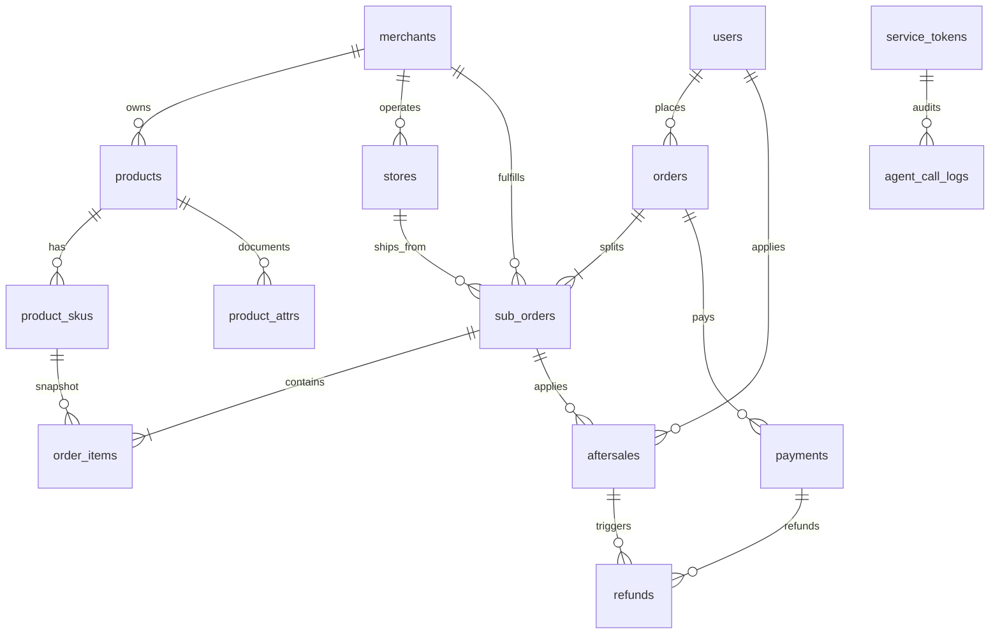

# DShop 架构设计 · 第 5 部分

> **内容**：§5 数据模型（41 表清单、ER 图、关键设计决策、自营多门店两形态）
> **导航**：[文档总目录](README.md) ｜ 上一部分：[04-Cloudflare资源与升级缝](04-Cloudflare资源与升级缝.md) ｜ 下一部分：[06-API路由命名空间](06-API路由命名空间.md)

---

## 5. 数据模型

存储 **D1（SQLite）**，统一约定：

- 主键一律 **ULID 字符串**（26 位，时间有序，利于游标分页与索引局部性）
- 金额一律 **整数（分）**，**D1 列名**后缀 `_amount`（如 `pay_amount`）；比例用万分比 `_bp`。**JSON 响应字段用 camelCase**（如 `payAmount`），与列名 snake_case 不混用（§7.1）
- 时间一律 **ISO-8601 字符串**（UTC，`YYYY-MM-DDTHH:mm:ss.sssZ`）
- **下单快照落 `order_items`**：商品标题/主图/规格/单价/商户名在下单瞬间固化，永不回查商品表
- 软删除用 `status` 枚举，不做物理删除（历史订单引用 `sku_id`）

### 5.1 表清单（按域分组，41 表）

> **与 PiEcho 相关的表以 ★ 标注**。Agent 六端点的数据全部来自这些 ★ 表及其关联表——**这 13 张 ★ 表是 M0 必须建好且有数据的第一优先级**（P1）。

| 域       | 表                         | 关键字段 / 说明                                                                                                                                                                                                                                                                                                                                                         |
| -------- | -------------------------- | ----------------------------------------------------------------------------------------------------------------------------------------------------------------------------------------------------------------------------------------------------------------------------------------------------------------------------------------------------------------------- |
| **会员** | `users`                    | `phone`（唯一，加密存储）、`nickname`、`avatar_url`、`status`、`wechat_openid`（预留）。★ Agent `/orders?phone=` 的查询入口                                                                                                                                                                                                                                             |
|          | `user_addresses`           | `user_id`、收件人、电话、省市区码、详址、`is_default`                                                                                                                                                                                                                                                                                                                   |
|          | `user_favorites`           | 收藏，`user_id` + `spu_id` 唯一                                                                                                                                                                                                                                                                                                                                         |
| **账号** | `admin_users`              | `username`（唯一）、`password_hash`（`pbkdf2$...` 带算法前缀）、`totp_secret`、`totp_enabled`、`status`、连续失败计数/锁定时间                                                                                                                                                                                                                                          |
|          | `roles`                    | `scope(platform/merchant)`、`code`、`name`、`permissions`(jsonb 权限点数组)                                                                                                                                                                                                                                                                                             |
|          | `admin_user_roles`         | 后台账号 ↔ 角色                                                                                                                                                                                                                                                                                                                                                         |
|          | `merchant_members`         | `merchant_id` + `admin_user_id` + 角色（owner/manager/staff），行级隔离依据                                                                                                                                                                                                                                                                                             |
|          | `refresh_tokens`           | `token_hash`、`scope`、`user_id`、`expires_at`、`revoked_at`（支持强制下线）                                                                                                                                                                                                                                                                                            |
|          | **★ `service_tokens`**     | Agent 服务令牌：`token_hash`（HMAC-SHA256 摘要）、`token_prefix`、`name`、`scopes`(jsonb)、`status`、`expires_at`、`last_used_at`、`rate_limit_per_min`、`created_by`                                                                                                                                                                                                   |
|          | `audit_logs`               | 操作者类型/ID、动作、资源、前后快照(jsonb)、IP；后台写操作与令牌管理强制落审计                                                                                                                                                                                                                                                                                          |
| **商户** | `merchants`                | `type(self/vendor/branch)`、`name`、`logo_url`、联系方式、资质图片、`status(pending/approved/suspended/rejected)`、`commission_rate_bp`、收款账户                                                                                                                                                                                                                       |
|          | **★ `stores`**             | `merchant_id`、`name`、`type(warehouse/store)`、经纬度、地址、营业时间、`supports_pickup`、`status`——**履约节点，Agent 库存接口 `shipFrom` 的数据来源**                                                                                                                                                                                                                 |
|          | `store_stocks`             | 门店级独立库存（二期按需启用，一期留空）                                                                                                                                                                                                                                                                                                                                |
| **商品** | `categories`               | `parent_id` 树形、`name`、`sort_order`、`status`                                                                                                                                                                                                                                                                                                                        |
|          | **★ `products` (SPU)**     | `merchant_id`、`category_id`、标题/副标题/主图、`detail_html`、`brand`、`status(draft/pending_review/onsale/offsale/rejected)`——Agent `/specs`、`/stock` 的主表                                                                                                                                                                                                         |
|          | **★ `product_skus`**       | `product_id`、`spec`(jsonb，如 `{"颜色":"黑","容量":"256G"}`)、`sku_code`、`price`、`stock`、`locked_stock`、`restock_eta`（预计到货日期，可空；**SKU 级**，Agent `/stock` 的 `restockEta` 来源，§7.5）、`status(active/inactive)`                                                                                                                                      |
|          | **★ `product_attrs`**      | SPU 级参数白皮书：`spu_id`、`group_name`（如"基本信息"/"保修"）、`attr_name`、`attr_value`、`unit`、`sort_order`、`searchable`。**这是 PiEcho 向量库里商品规格语料的唯一来源**（`seed.md` §2 的 IPX5/IP67、45dB 降噪等参数全部落在这张表）                                                                                                                              |
|          | `product_images`           | 图集，`sort_order`                                                                                                                                                                                                                                                                                                                                                      |
| **交易** | `cart_items`               | `user_id`、`sku_id`、`quantity`、`checked`、`merchant_id`（冗余，供结算页分商户展示）                                                                                                                                                                                                                                                                                   |
|          | **★ `orders`（主单）**     | `order_no`（唯一，**`^DS\d{17}$`**）、`user_id`、`status`、`total_amount`、`discount_amount`、`freight_amount`、`pay_amount`、`address_snapshot`(jsonb)、`coupon_id`、`channel(web/miniprogram/app)`、`pay_deadline`、支付/完成时间                                                                                                                                     |
|          | **★ `sub_orders`（子单）** | `sub_order_no`（唯一，`{orderNo}-{2位序号}`）、`order_id`、`merchant_id`、`store_id`、`status`、`subtotal`、`discount_alloc`、`freight`、`commission_amount`、`express_company`、`express_no`、`shipped_at`、`settled`                                                                                                                                                  |
|          | **★ `order_items`**        | `sub_order_id`、`sku_id`、**商品快照**（`title`/`image`/`spec`/`unit_price`）、`quantity`、`subtotal`                                                                                                                                                                                                                                                                   |
|          | **★ `order_status_logs`**  | 状态流转：`from`/`to`、操作者类型/ID、备注、时间。**物流轨迹与状态时间线的落库处**，Agent `/orders/{orderNo}` 的 `express.traces` 与状态时间来源                                                                                                                                                                                                                        |
|          | `payments`                 | `pay_no`、`order_id`、`channel(wechat/alipay)`、`amount`、`status`、`channel_trade_no`（**唯一约束，幂等锚点**）、`raw_callback`(jsonb)                                                                                                                                                                                                                                 |
|          | `refunds`                  | `refund_no`、`payment_id`、金额、状态、渠道退款单号                                                                                                                                                                                                                                                                                                                     |
|          | `idempotency_keys`         | `key`、`scope`、`result_ref`、唯一约束——下单/支付回调幂等                                                                                                                                                                                                                                                                                                               |
| **售后** | **★ `aftersales`**         | `aftersale_no`（唯一，**`^AS\d{11}$`**）、`sub_order_id`、`user_id`、`type(refund_only/return_refund)`、`status`、`reason`、`evidence_urls`(jsonb)、`refund_amount`、`return_express_no`、`deadline_at`                                                                                                                                                                 |
|          | **★ `aftersale_logs`**     | 售后状态流转与操作者记录（客服介入留痕）。**Agent `/aftersales/{no}` 的 `timeline` 来源**                                                                                                                                                                                                                                                                               |
|          | **★ `aftersale_policies`** | 售后政策条款：`category`（`return`/`refund`/`exchange`/`freight`/`warranty`）、`title`、`content`(markdown)、`version`、`effective_from`、`effective_to`、`status(draft/effective/archived)`（`draft` 草稿 / `effective` 已生效可对外 / `archived` 已归档）。**Agent `/policies/{category}` 的唯一来源，也是 PiEcho 政策语料的唯一来源**（`seed.md` §1 全文落在这张表） |
| **营销** | `coupon_templates`         | 归属（平台/商户）、类型（满减/折扣）、面值、门槛、总量/已领量、每人限领、有效期规则                                                                                                                                                                                                                                                                                     |
|          | `user_coupons`             | `template_id`、`user_id`、`status(unused/used/expired)`、`used_order_id`、`expire_at`                                                                                                                                                                                                                                                                                   |
|          | `freight_templates`        | `merchant_id`、计费规则 jsonb（首重/续重/满额包邮/包邮区域）                                                                                                                                                                                                                                                                                                            |
|          | `promotions`               | 满减/满赠活动，`scope`、规则 jsonb、时间窗                                                                                                                                                                                                                                                                                                                              |
| **内容** | `reviews`                  | `order_item_id`、`sku_id`、评分、内容、图、`status(待审/通过/驳回)`、商家回复                                                                                                                                                                                                                                                                                           |
|          | `content_blocks`           | 首页楼层/轮播/推荐位配置（jsonb）                                                                                                                                                                                                                                                                                                                                       |
|          | `cms_pages`                | 静态页/协议（含售后政策富文本镜像）                                                                                                                                                                                                                                                                                                                                     |
| **结算** | `settlements`              | 仅 `vendor` 商户参与；`merchant_id`、账期起止、订单数、销售额、佣金、退款、应结金额、`status(pending/confirmed/paid)`                                                                                                                                                                                                                                                   |
|          | `settlement_items`         | 结算单 ↔ 子单明细                                                                                                                                                                                                                                                                                                                                                       |
| **支撑** | `task_queue`               | `type`、`payload`(jsonb)、`status(pending/processing/done/failed)`、`attempts`、`run_at`、`last_error`                                                                                                                                                                                                                                                                  |
|          | `settings`                 | 平台参数（自动收货天数、客服电话、Agent 默认配额等）                                                                                                                                                                                                                                                                                                                    |
|          | **★ `agent_call_logs`**    | Agent 调用审计：`token_id`、`path`、`params_hash`、`status`、`duration_ms`、`cache_hit`、`contract_version`、`created_at`。**SLO 与 S10/S11 触发阈值的监测数据源**（§7.11）                                                                                                                                                                                             |

### 5.2 核心实体关系（ER 图）



关系要点（与 Agent 契约直接相关）：

- `orders`（主单）→ `sub_orders`（子单）为 **1:N 拆单**；`sub_orders` → `order_items` 为 **1:N 快照**，`order_items.sku_id` 仅作历史引用，展示一律取快照字段（§5.3 ①）。
- `merchants` → `stores` 为履约节点；`sub_orders.store_id` 指向履约门店，是 Agent `/products/{spuId}/stock` 中 `shipFrom` 的数据来源（§7.5）。
- `orders` → `payments` 为 **1:N**（一次支付一次成功流水，失败尝试可多条）；`payments` → `refunds` 为 **1:N**；`aftersales` 可触发 `refunds`。
- `users` → `orders` / `aftersales` 为 **1:N**；Agent 的 `/orders?userId=` 与 `/orders?phone=` 均落到 `users` 再关联主单（§7.3）。
- `products` → `product_attrs` 为 **1:N**；这是 PiEcho 侧商品规格知识语料的来源，**改动这张表等于改动 PiEcho 的答话依据**，需走 §14.3 变更流程。

### 5.3 关键设计决策

**① 主单 + 子单拆单模型**：一次结算含多商户商品时，生成 **1 个主单**（用户视角、一次支付、一个 `order_no`）+ **N 个子单**（商户视角，独立发货、独立售后、独立结算，各自 `sub_order_no`）。优惠券与运费在主单层计算后**按子单 `subtotal` 比例分摊**，写入 `sub_orders.discount_alloc`；`order_items` 落快照。用户侧只感知主单状态，商户侧只感知自己的子单。**Agent 接口必须同时返回主单与子单**（客服要回答"其中一个包裹还没发"，见 §7.2）——这是客服场景的硬需求，不是可选设计。

**② 库存原子锁定（不超卖）**：D1 无交互式事务，采用**单语句原子更新**，`changes === 0` 即库存不足。**口径：下单只锁定、支付才实扣**——`stock` 是物理库存，`locked_stock` 是已锁定未支付量，**可售库存 = `stock - locked_stock`**（与 §7.5 的字段口径完全一致）：

```sql
-- 下单：只锁定（不动物理库存），判据用可售库存
UPDATE product_skus
   SET locked_stock = locked_stock + ?
 WHERE id = ? AND stock - locked_stock >= ? AND status = 'active';

-- 支付成功：锁定转实扣
UPDATE product_skus
   SET stock = stock - ?, locked_stock = locked_stock - ?
 WHERE id = ? AND locked_stock >= ? AND status = 'active';

-- 超时关单 / 用户取消：只释放锁定（可售库存回补）
UPDATE product_skus
   SET locked_stock = locked_stock - ?
 WHERE id = ? AND locked_stock >= ?;
```

**三处口径必须一致**：下单成功 = 仅 `locked_stock` 增 q（可售库存 −q）；支付成功 = `stock` 减 q **且** `locked_stock` 减 q（可售库存不变）；超时关单 / 用户取消 = 仅 `locked_stock` 减 q（可售库存 +q）。**禁止写法**：下单时同时 `stock = stock - ?` 与 `locked_stock = locked_stock + ?`——那会让可售库存虚减 2q，且 `WHERE stock >= ?` 的判据与实际可售口径不符（少卖）。一个主单的「锁定全部 SKU + 写主单 + 写子单 + 写 `order_items` + 写状态日志」用 **`DB.batch()`** 打包为原子批次，任一语句 `changes=0` 则整批回滚。

> **为什么这条对 PiEcho 重要**：Agent `/stock` 返回的 `stock` 必须等于这里的「可售库存」口径。若两边口径不一致，客服会答出与实际下单不符的库存数——这是**客服话术事故**，不是普通 bug。因此 §7.5 的字段说明与本节 SQL 是同一口径的两种表述。

**③ 幂等**

| 场景                              | 机制                                                                                                                 |
| --------------------------------- | -------------------------------------------------------------------------------------------------------------------- |
| 下单                              | Header `Idempotency-Key`（客户端生成 ULID），结果落 `idempotency_keys`（`scope` + `key` 唯一），重放直接返回首次结果 |
| 支付回调                          | `payments.channel_trade_no` **唯一约束**兜底，重复回调命中唯一冲突即视为已处理并返回成功                             |
| 退款                              | `refunds.refund_no` 唯一 + 渠道退款单号唯一                                                                          |
| **Agent 读接口**                  | 全部 GET，天然幂等；PiEcho 侧允许安全重试（§7.8.4）                                                                  |
| **Agent 受控写（若启用，§7.12）** | 强制 Header `Idempotency-Key`，落 `idempotency_keys`，`scope='agent'`                                                |

**④ Agent 高频查询路径的索引**

```sql
CREATE UNIQUE INDEX uq_orders_no        ON orders(order_no);
CREATE INDEX idx_orders_user_time       ON orders(user_id, created_at DESC);
CREATE UNIQUE INDEX uq_sub_orders_no    ON sub_orders(sub_order_no);
CREATE INDEX idx_sub_orders_order       ON sub_orders(order_id);
CREATE UNIQUE INDEX uq_aftersales_no    ON aftersales(aftersale_no);
CREATE INDEX idx_aftersales_sub         ON aftersales(sub_order_id);
CREATE INDEX idx_product_attrs_spu      ON product_attrs(spu_id, group_name, sort_order);
CREATE INDEX idx_skus_product           ON product_skus(product_id, status);
CREATE INDEX idx_agent_logs_token_time  ON agent_call_logs(token_id, created_at DESC);
```

**⑤ 订单号与售后单号生成规则（本版明确，PiEcho 依赖此格式）**

| 单号                    | 格式                        | 正则               | 生成规则                                                                                              | 示例                     |
| ----------------------- | --------------------------- | ------------------ | ----------------------------------------------------------------------------------------------------- | ------------------------ |
| 主单号 `order_no`       | `DS` + 17 位数字（总长 19） | `^DS\d{17}$`       | 14 位秒级时间戳 `YYYYMMDDHHmmss`（**Asia/Shanghai，UTC+8**）+ 3 位当秒序列（`001`–`999`，同秒内自增） | `DS20260920143000123`    |
| 子单号 `sub_order_no`   | 主单号 + `-` + 2 位序号     | `^DS\d{17}-\d{2}$` | 主单下自增，从 `01` 起                                                                                | `DS20260920143000123-01` |
| 售后单号 `aftersale_no` | `AS` + 11 位数字（总长 13） | `^AS\d{11}$`       | 8 位日期 `YYYYMMDD`（**Asia/Shanghai**）+ 3 位当日序列                                                | `AS20260922001`          |
| 支付流水号 `pay_no`     | `PAY` + 17 位数字           | `^PAY\d{17}$`      | 同主单号规则（时间戳 + 序列）                                                                         | `PAY20260920143100001`   |
| 退款单号 `refund_no`    | `RF` + 17 位数字            | `^RF\d{17}$`       | 同主单号规则                                                                                          | `RF20260922030100001`    |

> **⚠️ 时区口径（易错）**：单号内嵌的时间戳是 **Asia/Shanghai（UTC+8）**，而 §5.1 规定**时间字段**（`createdAt` 等）一律用 ISO-8601 **UTC**（`...Z`）。两者**不是同一时区**：示例 `DS2026**0920143000**0123` 对应 `2026-09-20T**06:30**:00.000Z`（= 北京 14:30）。生成单号时须先转 UTC+8 再格式化，否则客服核对「下单时间」会差 8 小时。

> **⚠️ 这是一处必须跨文档统一的格式约定（重要）**：`seed.md`（PiEcho 的冷启动数据与测试用例来源）使用的是 `ORD` 前缀（如 `ORD20260918001`），与本契约的 `DS` 前缀**冲突**。PiEcho 侧的工具（`query_order_status`）会**硬编码 `^DS\d{17}$` 做正则校验**，若语料与 fixture 仍用 `ORD`，Golden 测试用例会在参数校验阶段直接失败。
>
> **本版定案：以本契约的 `DS` / `AS` 格式为准。** `seed.md` 派生的语料、PiEcho 的 fixture 包与 Golden 测试用例，**必须同步改为 `DS` / `AS` 格式**（见 §12.3 与 PiEcho 文档 §9.5 的对应条目）。此变更需在 M0 一次性完成，避免两侧返工。

### 5.4 自营多门店的两个子形态（A / B）：运营约束，非代码分支

| 子形态               | 商品与价格的归属                                                      | 门店职责                                             | 数据组织方式                                  |
| -------------------- | --------------------------------------------------------------------- | ---------------------------------------------------- | --------------------------------------------- |
| **形态 A：总部统管** | 商品、价格、库存**挂在总部 `type=self` 商户下**                       | 门店只做**履约**（接单、发货、自提），不改商品与价格 | 一个自营商户 + 多个 `stores` 履约节点         |
| **形态 B：门店自治** | 商品、价格、库存**挂在门店自己的 `type=branch` 商户下**，门店独立管理 | 门店既是履约方也是商品运营方                         | 总部商户 + 若干 `branch` 商户，各挂自己的商品 |

**关键约束（必须明确）**：

- **两者不存在代码分支、不存在环境配置差异、不存在开关位**。系统里只有一套商品模型（`products.merchant_id` 指向哪个商户）与一套履约模型（`sub_orders.store_id` 指向哪个门店）。**区别只是「商品挂在哪个商户下」这一数据组织方式**。
- 因此**可在运营期随时按门店调整、可共存、无需发版或重新部署**：同一平台上 A 形态门店与 B 形态门店可以同时存在，某门店从 A 切到 B（或反向）只是数据迁移操作（商品 `merchant_id` 改挂 + 商户记录增删），不涉及任何代码变更。
- **一期固定按 A 运营**（总部统一管商品价格库存，门店只做履约，免平台审核）；**B 的能力随数据模型天然就绪**——`merchants.type` 已含 `branch`、`merchant_members` 与 `merchantScope` 已支持商户级隔离、`stores` 已支持 `warehouse/store` 两类节点，运营期**开通一个 `branch` 商户即启用**，不需要预留任何额外结构。
- 两种子形态都**不参与结算**（`commission_rate_bp` 恒为 0，`settlements` 仅 `vendor` 商户参与，§5.1 结算域），资金始终归平台（§11.2）。

---
