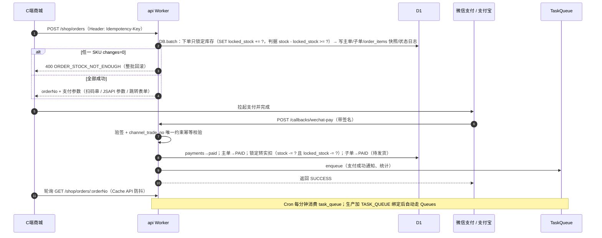
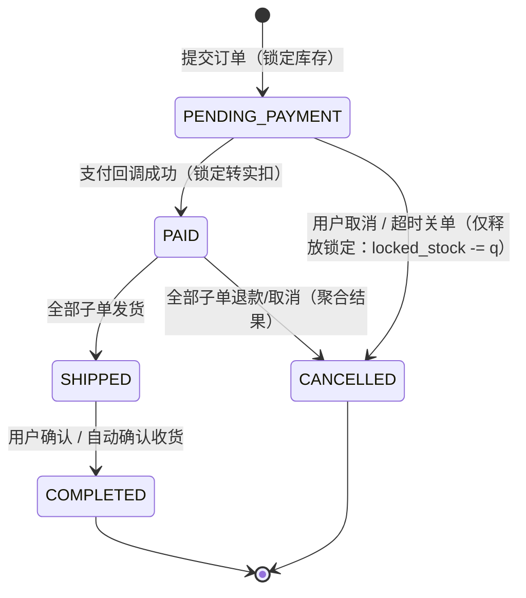

# DShop 架构设计 · 第 8 部分

> **内容**：§8 核心业务流程（登录、下单支付、订单状态机、售后、履约结算、异步任务、客服场景数据链路）
> **导航**：[文档总目录](README.md) ｜ 上一部分：[07-Agent-API契约](07-Agent-API契约.md) ｜ 下一部分：[09-认证权限与部署](09-认证权限与部署.md)

---

## 8. 核心业务流程

本章描述商城的业务流转。**与 PiEcho 直接相关的环节以 ★ 标注**——这些环节产出的数据正是 Agent 端点的数据来源（§8.7 汇总为完整链路）。

### 8.1 登录

- **C 端**：手机号 + 短信验证码（60s 冷却、图形验证码防刷、按 IP/手机号限流）→ JWT + Refresh Token；预留微信 OAuth。
- **后台**：用户名 + 密码（PBKDF2）+ **TOTP 两步验证**（平台管理员强制，商户管理员可选）；连续失败 5 次锁定 15 分钟。
- **Agent**：无登录流程，用长期服务令牌（§7.8.1）。

### 8.2 下单与支付时序



支付渠道与端的对应：PC 用微信 Native（扫码）+ 支付宝电脑网站支付；H5 用微信 H5/JSAPI + 支付宝手机网站支付；小程序/APP 渠道参数在 `/orders/:orderNo/pay` 的 `channel` 参数中区分，接口不变。

★ **对 PiEcho 的意义**：下单成功即产生 `orders` + `sub_orders` + `order_items`（商品快照），这是 Agent `/orders/{orderNo}` 的全部数据来源。**商品快照在下单瞬间固化**，因此即使后续商品改价或下架，客服查历史订单仍能答出「当时买的是什么、多少钱」——这是客服场景的必要语义。

### 8.3 订单状态机



子单独立维护 `PAID → SHIPPED → COMPLETED`，以及退款/取消后的 `CANCELLED`；**主单状态恒由子单聚合得出，不单独维护**。聚合规则（按优先级自上而下判定，`statusText` 同步给出）：

| 优先级 | 全部子单的状态集合                                                       | 主单聚合结果 | 说明                                                       |
| ------ | ------------------------------------------------------------------------ | ------------ | ---------------------------------------------------------- |
| 1      | 全部 `CANCELLED`（退款完成 / 用户取消）                                  | `CANCELLED`  | **全部子单退款或取消 → 主单 `CANCELLED`**，与子单枚举自洽  |
| 2      | 剔除 `CANCELLED` 后全部 `COMPLETED`                                      | `COMPLETED`  | 全部有效子单完成才完成（全 `CANCELLED` 已被优先级 1 截获） |
| 3      | 剔除 `CANCELLED` 后全部 ∈ {`SHIPPED`, `COMPLETED`}，且至少一个 `SHIPPED` | `SHIPPED`    | 全部发货才发货                                             |
| 4      | 其余（剔除 `CANCELLED` 后存在任一 `PAID` 待发货）                        | `PAID`       | 只要还有有效子单待发货，主单停在已支付                     |

> **★ 聚合前先剔除 `CANCELLED` 子单**：这是本规则的关键——已退款/已取消的子单**不再参与后续聚合**（视为该子单的交易已终结）。若不做剔除，集合 `{CANCELLED, COMPLETED}`（1 个退款 + 1 个已完成）将不满足优先级 1/2/3，只能落优先级 4 = `PAID`，**且因剩余子单早已 `COMPLETED` 而永远无法再流转**——主单会永久卡在 `PAID`。剔除后该集合变为 `{COMPLETED}`，落优先级 2 → 主单 `COMPLETED`，语义正确。

**部分退款 / 部分取消**：仅该子单落 `CANCELLED`，主单按上表**剔除已取消子单后**重新聚合（例如 2 个子单中 1 个退款、1 个已完成 → 剔除后集合 `{COMPLETED}` → 主单 `COMPLETED`）；退款金额级联汇总到主单（`aftersaleSummary.refundedAmount`），**不因此把主单置 `CANCELLED`**。售后发生在 `PAID` 之后任意状态。**每次流转写 `order_status_logs`**。

★ **对 PiEcho 的意义**：**主单与子单状态必须同时下发**（§7.2）。客服最常见的问题之一就是「我买了三件，为什么只发了一件」——答案藏在子单状态的差异里。若 Agent 只返回主单状态，这类问题无法回答。聚合规则本身也解释了为什么主单停在 `PAID` 而部分包裹已发出。

### 8.4 售后流程

```
用户申请（仅退款 / 退货退款）
  → PENDING_MERCHANT 商家处理（同意 / 驳回；超时未处理自动同意）
     ├─ 仅退款：同意 → REFUNDING → 调渠道退款 API → 回调 → REFUNDED
     └─ 退货退款：同意 → WAIT_BUYER_RETURN（下发退货地址）
          → 用户回寄并填单号 → BUYER_RETURNED
          → 商家确认收货 → MERCHANT_RECEIVED → REFUNDING → 渠道退款 → REFUNDED
平台客服可全程介入改判（强制同意 / 驳回），全程落 aftersale_logs + audit_logs。
退款成功后：子单结算金额扣减；若主单全部子单均已退款/取消，主单按 §8.3 聚合规则置 CANCELLED（部分退款则按聚合表重新判定，不置 CANCELLED）。
```

★ **对 PiEcho 的意义**：`aftersale_logs` 是 Agent `/aftersales/{no}` 中 `timeline` 的唯一来源。**每一次状态流转都必须写这条日志**，否则客服无法回答「我的退货现在到哪一步了」。特别注意 `WAIT_BUYER_RETURN` 状态需携带退货地址（脱敏后下发），这是客服回答「我需要寄回吗、寄到哪」的依据。

### 8.5 履约分配与结算

**履约分配（自营）**：下单后为自营子单分配履约门店——按收货地址与门店位置/库存就近分配（一期：优先级 + 后台手动改派）；用户自提时在结算页选店。平台化模式下 vendor 子单固定为其唯一门店（仓库），无分配环节。★ 分配结果写 `sub_orders.store_id`，**也是 Agent 库存接口 `shipFrom` 的数据来源**（§7.5）——客服回答「从哪发货」依赖这个字段。

**结算（平台化模式）**：Cron 按 T+N 账期扫描各 `vendor` 商户已完成子单 → 生成结算单（销售额 − 佣金 − 退款差额 = 应结金额）→ 平台财务确认 → 打款并标记已付。自营模式无结算流程（平台直收），仅提供经营报表；资金合规见 §11.2。**结算与 PiEcho 无关**（Agent 不下发任何资金与佣金数据，§7.8.2）。

### 8.6 异步与定时任务

| 任务                               | 触发        | 说明                                                                                                                                                           |
| ---------------------------------- | ----------- | -------------------------------------------------------------------------------------------------------------------------------------------------------------- |
| 通知发送（支付成功/发货/售后进度） | TaskQueue   | 短信/邮件 API，失败按 `run_at` 退避重试                                                                                                                        |
| 超时未支付关单                     | Cron 每分钟 | 生产者在下单成功后入队 `order.timeout_cancel` 并带 `delaySeconds` = 支付期限剩余秒数（`task_queue.run_at` / Queues `delaySeconds` 据此推迟）；消费者（Cron 轮询 / Queues 出口）**二次校验支付期限**：未到期则把任务延后到该时刻、**绝不关单**，已到期才关单 + 仅释放锁定（`locked_stock -= q`，不动物理 `stock`，§5.3 ②）。**期限取值的两级兜底**：优先 `orders.pay_deadline`；若它为 `NULL` 或非法串，则退到 `createdAtMs + ORDER_PAY_TIMEOUT_MINUTES`（且 `createdAtMs` 必须落在 `(0, now]` 的合理性窗口内）；**两者都不可用**时**绝不关单**，置任务 `failed` + 结构化告警（`task_pay_deadline_unresolvable`），交人工介入。**没有独立的 `pay_deadline` 扫描器**——关单判据只有这条任务 |
| 自动确认收货                       | Cron 每小时 | 发货后 N 天自动完成（N 取 `settings`）                                                                                                                         |
| 结算单生成                         | Cron 每日   | 按 T+N 汇总 vendor 子单                                                                                                                                        |
| 优惠券过期                         | Cron 每日   | 批量置失效                                                                                                                                                     |
| ★ 物流轨迹同步                     | Cron 每小时 | 拉取在途子单轨迹落库（写 `order_status_logs`），**供 Agent `/orders/{orderNo}` 的 `express.traces` 读取**。非实时直连快递商，`latestStatusAt` 表明新鲜度       |
| ★ `agent_call_logs` 落库           | Cron 每分钟 | 批量写入 Agent 调用审计。**SLO 监测与 S10/S11 触发阈值的唯一数据源**（§7.11）                                                                                  |
| task_queue 消费                    | Cron 每分钟 | 按类型分发，单次最多 N=50 条；`processing` 超时重回 `pending`（幂等），`attempts >= TASK_MAX_ATTEMPTS`（=5，代码常量；表无此列）置 `failed` **进死信**；失败重试按 `run_at = now + min(60·2^(attempts-1), 3600)` 秒有界退避。**死信可重放是真实端点而非文档声称**：`GET /api/v1/admin/task-queue`（列表，默认只列 `failed`）、`GET /api/v1/admin/task-queue/:id`（详情）、`POST /api/v1/admin/task-queue/:id/replay`（重放：单条原子 UPDATE，守卫 `status='failed'` 写在 SQL 的 `WHERE` 里；**类型未在本版本注册时先拒后写**，避免把跑不了的任务塞回队列）。权限点 `task:dead_letter:manage`，平台超管持有；写操作落 `audit_logs`（`task_queue.replay`）。实现见 `apps/api/src/routes/admin/task-queue.ts` |

### 8.7 客服场景数据链路（本版新增：从 seed.md 场景到 Agent 端点）

本节把 `seed.md` 的四个 Golden 测试场景与 DShop 的数据链路一一对应，作为 **M0 客服场景数据集**（§12.3）的设计依据，也是「数据先于功能」（P1）的具体化。

| `seed.md` 场景                 | 用户输入（摘要）                      | PiEcho 调用的工具                                                              | DShop 数据来源                                                                                                 | M0 必须有数据              |
| ------------------------------ | ------------------------------------- | ------------------------------------------------------------------------------ | -------------------------------------------------------------------------------------------------------------- | -------------------------- |
| **场景一**：产品参数边界与客诉 | 「耳机戴着游泳进水了，要退货」        | `search_knowledge`（IPX5/进水/退货）+ `query_order_status` + `query_aftersale` | `product_attrs`（防水等级、使用禁忌）+ `aftersale_policies`（人为损坏界定、运费归属）+ `orders` / `aftersales` | ✓ 全部四类                 |
| **场景二**：订单物流查询       | 「单号 ORD…002（→ `DS…`）怎么还没到」 | `query_order_status`                                                           | `orders` + `sub_orders`（`express_*`）+ `order_status_logs`（`traces`）                                        | ✓ 订单 + 物流轨迹          |
| **场景三**：防幻觉             | 「支持心率监测吗？」                  | `search_knowledge`（心率监测）                                                 | `product_attrs`（**必须存在但明确不含心率相关参数**——「不存在」本身是可检索的事实）                            | ✓ 商品规格（含完整参数集） |
| **场景四**：情绪激化转人工     | 「别扯规矩，找负责人，不然投诉」      | `handover_to_human`（PiEcho 侧工具，不调 DShop）                               | 无（PiEcho 侧工单落自己的 `tickets` 表）                                                                       | —                          |

**三条对 DShop 的硬性要求**（由本表推导）：

1. **场景一与场景三要求 `product_attrs` 中的参数必须「完整且包含边界信息」**——不只是营销卖点。IPX5 等级、使用禁忌（不可游泳/淋浴）、充电仓不防水，这些「负面信息」必须作为一等参数落库。若只存「45dB 降噪、36 小时续航」这类正面参数，场景一与场景三都无判据。
2. **场景三的「防幻觉」依赖「参数集完整」**——Agent 需要能检索到商品全部参数后确认「无心率监测」。若 `product_attrs` 只有零星几条，Agent 无法区分「没有这个功能」与「这条没录进来」，防幻觉测试不成立。
3. **场景二的订单号前缀必须与契约一致**——`seed.md` 用 `ORD`，契约用 `DS`，**M0 必须统一为 `DS`**（§5.3 ⑤）。否则 PiEcho 的工具在正则校验阶段就拒绝该订单号，场景二无法执行。

---
